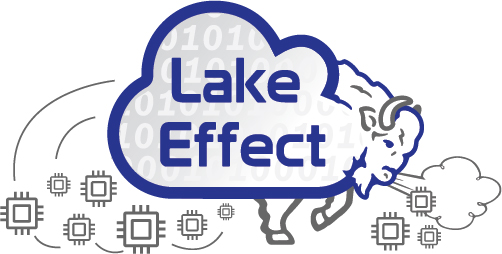

## LakeEffect Research Cloud _(On-Premise Cloud)_

CCR hosts a subscription based on-premise cloud service affectionately known as **"Lake Effect"**, which provides access to virtual servers, storage and networking that users setup and manage themselves. It is what is referred to as Infrastructure as a Service and is equivalent in functionality to Amazon's EC2 Cloud service.

Although high performance computing (HPC) is our largest and most widely used service, CCR recognizes that not all research requires number crunching on large scale computers (clusters). Lake Effect, was put into service to provide flexible infrastructure to support research computing such as webservers, databases, and long-running services that are not suited for HPC clusters. This along with our HPC platform allows us to provide a complete set of tools to support all the different research groups and collaborations througout UB.

### Lakeeffect Quick Start

1. Details on Pricing and Subscription packages is [here](subscriptions.md)
2. Request access through the [coldfront](../portals/coldfront.md) allocations management portal
3. Once you have an active allocation, you can access the cloud through the [Dashboard](https://dashboard.cloud.ccr.buffalo.edu)
4. Documenation on using Lakeeffect Cloud and Openstack:
	- [Using LakeEffect Cloud](./using.md)
	- [OpenStack Documentation](https://docs.openstack.org/)

### Features

Features of Lake Effect:

- Deploy virtual servers in minutes
- Storage volume creation/snapshot
- VPC Networking with access to public IP address space as well as the ability to create private networks
- Wide range of Machine Types available inclunding GPUs and IO Optimized Storage
- Various Linux operating systems are supported.  _**NOTE**: Windows images are not provided be CCR at this time_
- Public Images of opensource Linux Distributions available as well as the ability for users to upload their own
- Load balancing of virtual resources across multiple physical machines
- Support for Floating IP addresses
- Easily manage access to VMs using Security Groups and Rules
- Built on Openstack Cloud Software [Openstack](https://www.openstack.org/) 
- Fault tolerant components to minimize risk of downtime due to underlying hardware failure

### LakeEffect Resources
> - 768 total CPU cores
> - 8.8TB RAM (4GB per vCPU core)
> - 1.7PB of object-oriented storage
> - NVidia V100 vGPUs
> - NVME Ephemeral Storage 
> - Persistant Memory (PMEM) Storage 

### Use and Misuse

CCR Staff manages and maintains the Cloud platform, both the physical ifrastructure and openstack software. Users are expected to deploy and manage their cloud instances, including network security and protocols, installing and maintaining software, and running computational workflows. Users are “system administrators” of their cloud instance(s) and are responsible to ensure that [UB Minimum Server Security and Hardening Standards](https://www.buffalo.edu/ubit/policies/guidance-documents/server-security-and-hardening.html) are deployed.

!!! Note 
    System administration within LakeEffect cloud instances by CCR staff requires the purchase of custom consulting time.

#### Appropriate use cases:
- Academic courses (teach cloud computing, computer science, or HPC)
- Web portals for science gateways "Hubs" (JupyterHub, Shiny Apps)
- Running a research database/website application that interacts with the CCR Compute Clusters.
- Testing and development of software or products

#### Inappropriate use cases: 
- Personal websites or websites unrelated to research
- Infrastructure that should be provided by IT Department
- Running workflows that can more efficiently be run through Slurm on our clusters
- Running VMs to Circumvent UB Server Security standards or IT Departmental regulations

!!! Warning
    LakeEffect Research Cloud is **NOT** HIPPA compliant, storing any sensitive or identifiable data is strictly prohibited.

