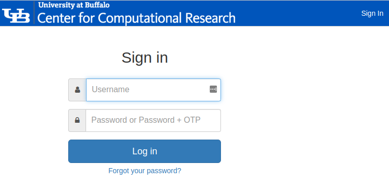

## Using the LakeEffect Research Cloud

### Managing your Project with the Cloud Dashboard

Once you've requested and been granted an account on the Lake Effect cloud, you will be able to login in to the web console.
Your username and password for Lake Effect are the same as your CCR username and password.  However, you need additional 
privileges to be allowed to login to the cloud.  You will be informed when your cloud account is ready.

[The Lake Effect Dashboard (Horizon)](https://dashboard.cloud.ccr.buffalo.edu) - simplifies management of your project's cloud resources and provides information on your group's usage.

You will need to authenticate to CCR's **Identity Management System** with your CCR username and password+otp
For more information about logging in with two-factor authentication enabled click [here](../2fa.md).

After a successful login, you will be redirected to your project **Overview** in the LakeEffect Dashboard:

### Managing Openstack Credentials

**Key pairs** are SSH credentials which are injected into images when they are launched.  Creating a new key pair in Openstack registers the public key and downloads the private key.  In order to connect to any cloud instances you will need to utilize an SSH key pair.  

!!! Note
    The first time you login to the  **Openstack Management Console** you need to create a key pair so that you'll be able to remotely connect to your instances. This should be the first thing you do.

There are two ways to accomplish this:

1. Create the key pair in the **Openstack Management Console**, or  
2. Upload an existing SSH public key to Openstack that you've generated on your personal computer  

!!! Alert
    The Private key of the Keypairs should be stored in a safe place and kept very secure.
    If these credentials were to be compromised, an attacker would gain full access to your Instances. 
    Do NOT store these credentials on front end machines of the clusters or shared storage 
    (such as home or project directories or global scratch).

#### Creating a key pair in Openstack

1. Click on the **Key Pairs** menu
2. Click on the `+Create Key Pair`

3. Enter a Key Pair Name 
4. Select "SSH Key" for Key Type
5. Click on the `Create Key Pair`

Your keypair will be created and your browser will save the private (pem) file locally.
You will use this pem file to ssh into you instances. 

#### Importing existing key pair in Openstack

1. Click on the **Key Pairs** menu
2. Click on the `+Import Public Key`

3. Enter a Key Pair Name 
4. Select "SSH Key" for Key Type
5. Choose file location of your public key or paste the public key into the form
6. Click `Import Public Key`

You can use many different key pairs on your account, if desired. You will be able to choose which pair is used when launching an instance.

!!! Tip
    It is recommended that all users in a LakeEffect project have their own keypairs.
    This is much more secure than one shared keypair for the group and provides more
    accountability. 

### Security Groups

Security groups are an important concept to understand in Openstack.  Security groups define a set of IP filter rules that determine how network traffic flows to and from an instance like a firewall. Because the Cloud needs to be flexible, the Lake Effect public IP address space is not protected by the UB firewall; therefore, it's critical that you setup secure access to your instances. Security groups are the primary method from protecting your VMs from Internet Security Threats. 

#### Creating Security Groups

1. Click on the **Network -> Security Groups** menu

2. Click on the `+Create Security Group`

3. Name the Security Group and give it a description
4. Click `Create Security Group`

You will now be able to manage the individual rules in the Security group you just created

#### Managing Security Group Rules

1. Click on the **Security group** to modify
2. Click on the `+Add Rule`

3. Fill in all the fields depending on the rule you want to create and click `Add`
4. Continue to add all the necessary rules to open access to the VM.

!!! Danger
    Only open ports for the services you require and only open those ports to the IP addresses that you want to provide access to.
    It is absolutely crucial that you do **NOT** open all ports to the world!

### Creating an Instance

### Logging in to your Instance

