## Using the LakeEffect Research Cloud

### Managing your Project with the Cloud Dashboard

Allocations to the LakeEffect Cloud are requested and managed through the ColdFront Resource Allocations Management Tool.
To request an allocation to LakeEffect [see here](../getting-access.md#allocation-requests).  
Once approved through ColdFront you will be informed when your cloud access is ready and you will be able to login in to the LakeEffect Web Console
where you can manage your project's cloud resources and view information on your group's usage.  

!!! Warning "VPN Required"
    Access to the LakeEffect Dashboard is restricted to UB and Roswell Park networks
    (either on campus or connected to their VPN services). [See here](../getting-access.md#vpn-access)

From the [The LakeEffect Web Console](https://dashboard.cloud.ccr.buffalo.edu), select CCR OpenID Connect option and authenticate using your CCR account. Don't have an account? [see here](../getting-access.md)

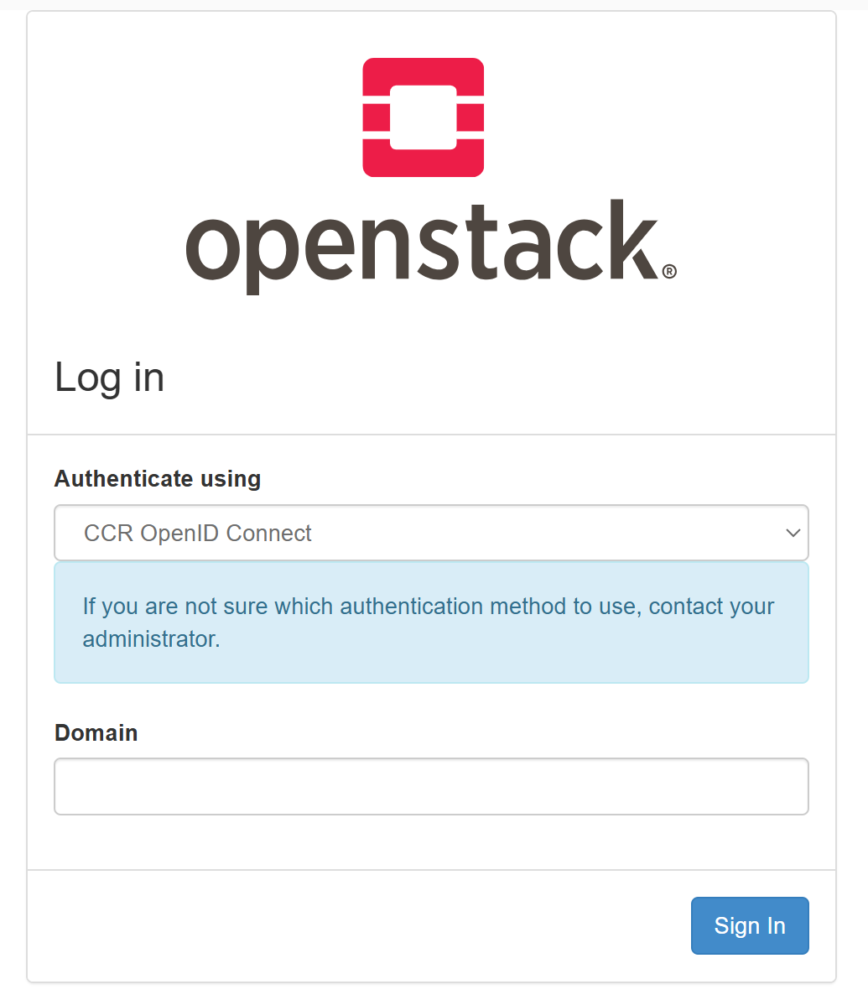

After a successful login, you will be redirected to your project **Overview** in the LakeEffect Dashboard:

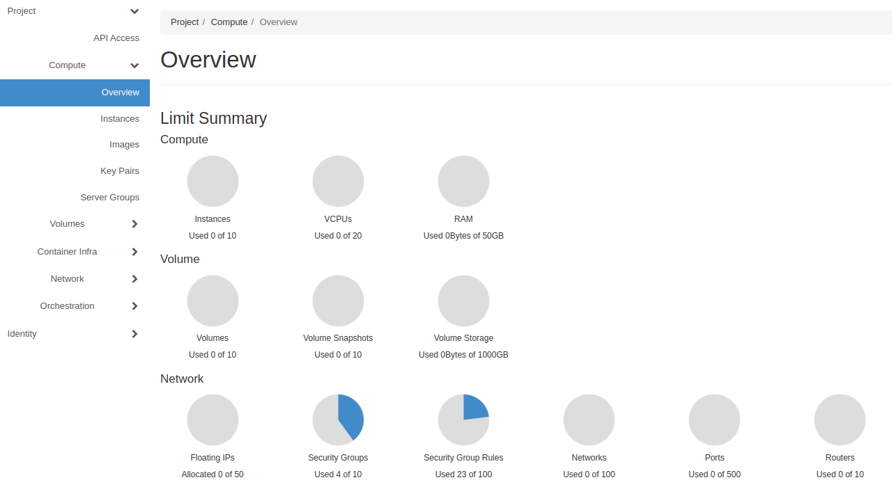

### Managing Openstack Credentials

#### Keypairs

**Key pairs** are SSH credentials which are injected into images when they are launched.  Creating a new key pair in Openstack registers the public key and downloads the private key.  In order to connect to any cloud instances you will need to utilize an SSH key pair.  

!!! Note
    The first time you login to the  **Openstack Management Console** you need to create a key pair so that you'll be able to remotely connect to your instances. This should be the first thing you do.

There are two ways to accomplish this:

1. Create the key pair in the **Openstack Management Console**, or  
2. Upload an existing SSH public key to Openstack that you've generated on your personal computer  

!!! Alert
    The Private key of the Keypairs should be stored in a safe place and kept very secure.
    If these credentials were to be compromised, an attacker would gain full access to your Instances.
    Do NOT store these credentials on front end machines of the clusters or shared storage
    (such as home or project directories or global scratch).

#### Creating a key pair in Openstack

1. Click on the **Key Pairs** menu
2. Click on the `+Create Key Pair`
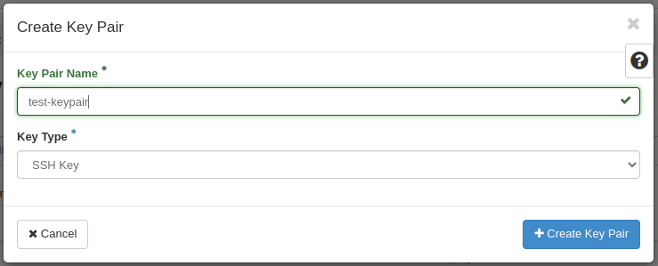
3. Enter a Key Pair Name
4. Select "SSH Key" for Key Type
5. Click on the `Create Key Pair`

Your keypair will be created and your browser will save the private (pem) file locally.
You will use this pem file to ssh into you instances.

#### Importing existing key pair in Openstack

1. Click on the **Key Pairs** menu
2. Click on the `+Import Public Key`
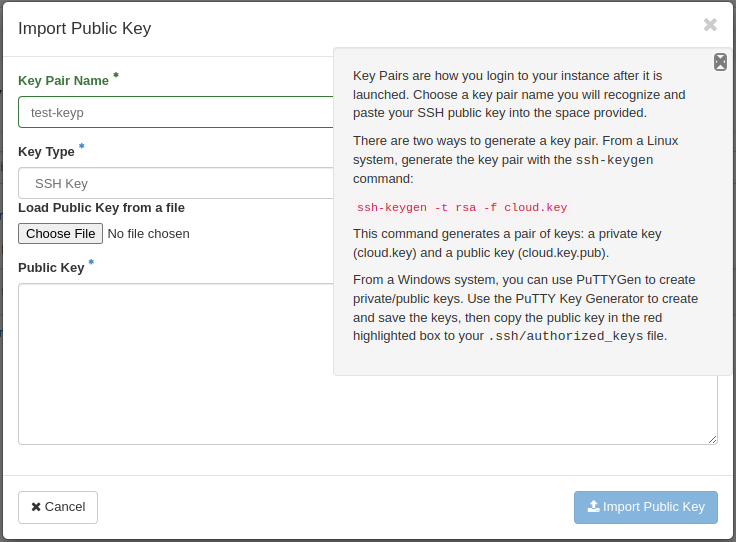
3. Enter a Key Pair Name
4. Select "SSH Key" for Key Type
5. Choose file location of your public key or paste the public key into the form
6. Click `Import Public Key`

You can use many different key pairs on your account, if desired. You will be able to choose which pair is used when launching an instance.

!!! Tip
    It is recommended that all users in a LakeEffect project have their own keypairs.
    This is much more secure than one shared keypair for the group and provides more
    accountability.

### Security-Groups

Security groups are an important concept to understand in Openstack.  Security groups define a set of IP filter rules that determine how network traffic flows to and from an instance like a firewall. Because the Cloud needs to be flexible, the LakeEffect public IP address space is not protected by the UB firewall; therefore, it's critical that you setup secure access to your instances. Security groups are the primary method from protecting your VMs from Internet Security Threats.

#### Creating Security Groups

!!! Note
    The **default** rule in LakeEffect only allows outbound (egress) traffic - no inbound (ingress)
    traffic is permitted. We recommend you create a new security group and leave the default
    group alone. If you remove the default security group you will need to add these rules to your
    own security group otherwise you will not be able to connect to your instance.

1. Click on the **Network -> Security Groups** menu
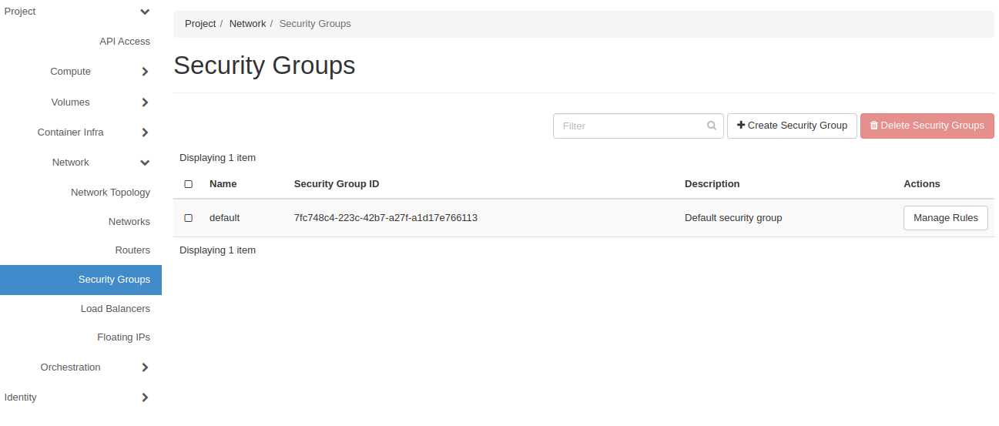
2. Click on the `+Create Security Group`
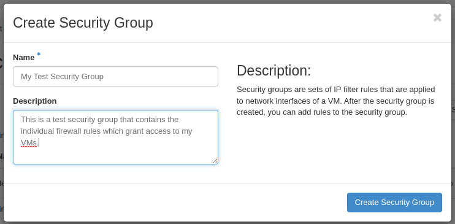
3. Name the Security Group and give it a description
4. Click `Create Security Group`

You will now be able to manage the individual rules in the Security group you just created
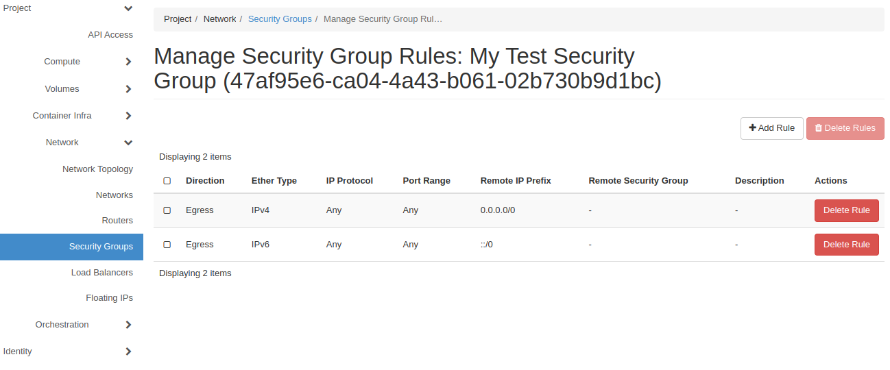

#### Managing Security Group Rules

1. Click on the **Security group** to modify
2. Click on the `+Add Rule`
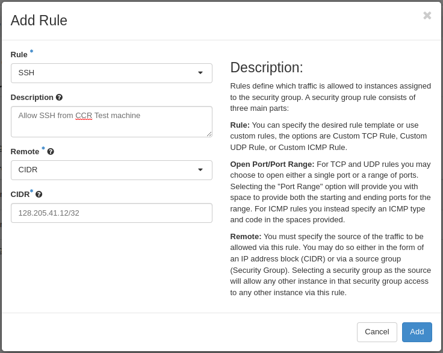
3. Fill in all the fields depending on the rule you want to create and click `Add`
4. Continue to add all the necessary rules to open access to the VM.

!!! Danger
    Only open ports for the services you require and only open those ports to the IP addresses that you want to provide access to.
    It is absolutely crucial that you do **NOT** open all ports to the world!

### Instances

**Instances** are virtual machines that run inside the cloud, they are the basic units of compute you will use within LakeEffect. An **Instance** is made up of a **Flavor**, an **Image** and it is attached to a **Network** for it to connect to.

For more information about instances, flavors and images please see the official Openstack Guide:  
> -  [OpenStack Documentation](https://docs.openstack.org/nova/latest/user/launch-instances.html)

#### Flavors

> ###### Standard

> | Instance Type | vCPU | Memory | Storage |
> | :---     |    ---:  |   ---: |    ---:|
> | std-compute-1    | 1 cores  | 4 GB   | 20 GB  |
> | std-compute-2    | 2 cores  | 8 GB   | 40 GB  |
> | std-compute-4   | 4 cores  | 16 GB  | 80 GB  |
> | std-compute-8   | 8 cores  | 32 GB  | 160 GB  |
> | std-compute-10  | 10 cores | 40 GB  | 200 GB  |
> | std-compute-16 | 16 cores | 64 GB | 320 GB |
> | std-compute-32 | 32 cores | 128 GB | 640 GB |

> ###### Advanced

!!! Note
    Advanced or GPU Subscription required to access GPU or Fast-IO Flavors

>> **GPU**

> | Instance Type | GPU | vCPU | Memory | Storage |
> | :---     |  :----: |   ---:  |   ---: |    ---:|
> | adv-gpu-8   | V100-32 | 8 cores  | 32 GB   | 100 GB  |
> | adv-gpu-16 | V100-32 | 16 cores | 64 GB   | 100 GB |

>> **FastIO**

!!! Note
    FastIO/NVME Storage is volatile (instance storage) and will be destroyed when the instance is deleted.

> | Instance Type | vCPU | Memory | NVME Storage | Block Storage |
> | :---     |    ---: |   ---:  |   ---: |     ---:|
> | adv-nvme-4   | 4 cores   | 16 GB   | 100 GB | 80 GB  |
> | adv-nvme-8   | 8 cores   | 32 GB   | 250 GB | 160 GB  |
> | adv-nvme-16   | 16 cores   | 64 GB   | 500 GB | 320 GB  |

> | Instance Type | vCPU | Memory | PMEM Storage | Block Storage |
> | :---     |    ---: |   ---:  |   ---: |     ---:|
> | adv-pmem-16   | 16 cores   | 64 GB   | 500 GB | 320 GB  |
> | adv-nvme-32   | 32 cores   | 128 GB   | 1000 GB | 640 GB  |

> ###### Custom Flavors

If you require a flavor that is not listed, you can contact [Contact CCR Help](../help.md) and we can work with you on creating a custom flavor that suits your needs.

#### Images

An **Image** is a stock copy of an operating system that you will provision your instance with.
CCR provides a current set of the major Linux distributions which are updated perodically.
These are all stock images pulled directly from the various vendor repos. Due to license restrictions, CCR does not provide Microsoft Windows images.

> |Operating System | Version | Build Date |
> | :----: | ---: | ---: |
> | CentOS | 8-stream | 2024-04-16|
> | CentOS | 9-stream | 2024-04-16|
> | Debian | 12.5 | 2024-04-15|
> | Fedora | 39 | 2023-11-01|
> | Rocky  | 8.9 | 2023-11-19|
> | Rocky  | 9.3 | 2023-11-13|
> | Ubuntu  | 20.04 | 2024-04-08|
> | Ubuntu  | 22.04 | 2024-04-16|

### Creating an Instance in LakeEffect

!!! Note
    Before you can launch and login to instances, you must have setup a key pair as described [here](#keypairs)

From the LakeEffect Dashboard go to **Compute -> Instances**

Click on `Launch Instance` button at the top right corner. This will bring up the instance launcher which will guide you in creating your new instance by selecting your instance source, Flavor, Network, Security groups, and Keypair.

!!! Note
    Your project has a quota set for the total number of instances you're permitted to run.  The chart on the right shows the current usage.  If you've hit your limit, please [Contact CCR Help](../help.md) for assistance.

##### Step 1: Details

> * Fill out **instance name** and **description**  
> * **Availability zone:** can be left as default.  
> * **Count:**  is the number of instances you want to start up.  

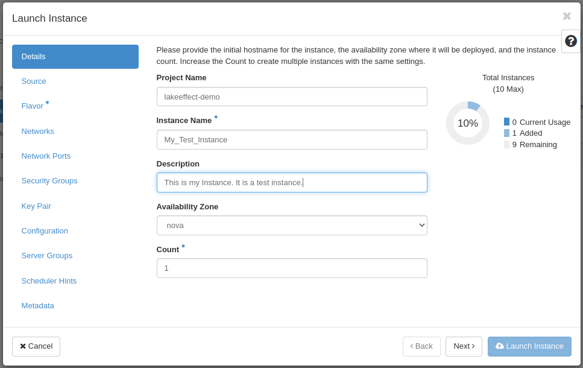

> * click `Next` when done to go to the ___Source___ screen.

##### Step 2: Source

On the **Source tab**, there are many things you need to consider when deciding how you want your instance created.  

> **Select boot source:** Options are Image, Instance Snapshot, Volume, Volume Snapshot  
> **Create a new volume:** Yes/No (default is Yes which is what we recommend)  
> **Volume Size:** Choosing an image will auto-populate the size, but you can choose a larger size.  
> **Delete Volume on Instance Delete:**  Default is No (we recommend selecting Yes unless you want to use this volume attached to other instances)  

!!! Note
    You should pay attention to volume sizes and orphaned volumes because it all counts against your volume storage quota.

> If **Boot source** is **Image**, Choose an operating system from the list of images CCR provides.

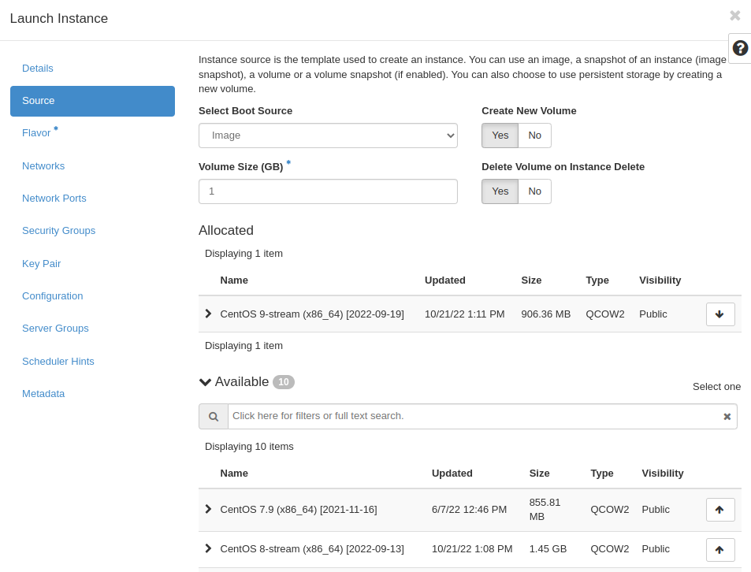

> * click `Next` when done to go to the ___Flavor___ screen.

##### Step 3: Flavor

A **Flavor** defines the compute, memory, and storage capacity of our instance.
> * Choose the most appropriate sizing for your use case from a list of pre-selected resources

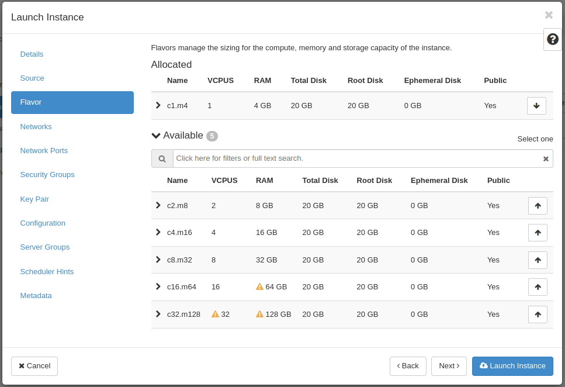

!!! Note
    Depending on your usage and quota, not all flavors may be available. This is denoted by the yellow triangles next to the particular resource not available.

> * click `Next` when done to go to the ___Networks___ screen.

##### Step 4: Networks

The ___ccr-public___ is the default Provider Network available to Instances. This network will allocate an IP on the UB public network.

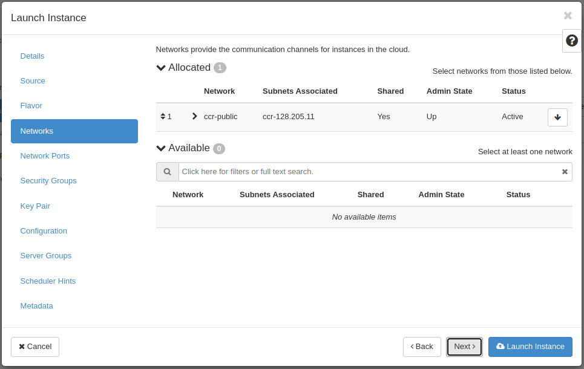

LakeEffect users have the ability to create their own Private networks but that is an [Advanced](./advanced.md) concept and not documented in this Guide.

> * click `Next` when done to go to the ___Network Ports___ screen.

##### Step 4: Network Ports

Unless you have created your own Private Network and Ports, there is nothing needed in this section.

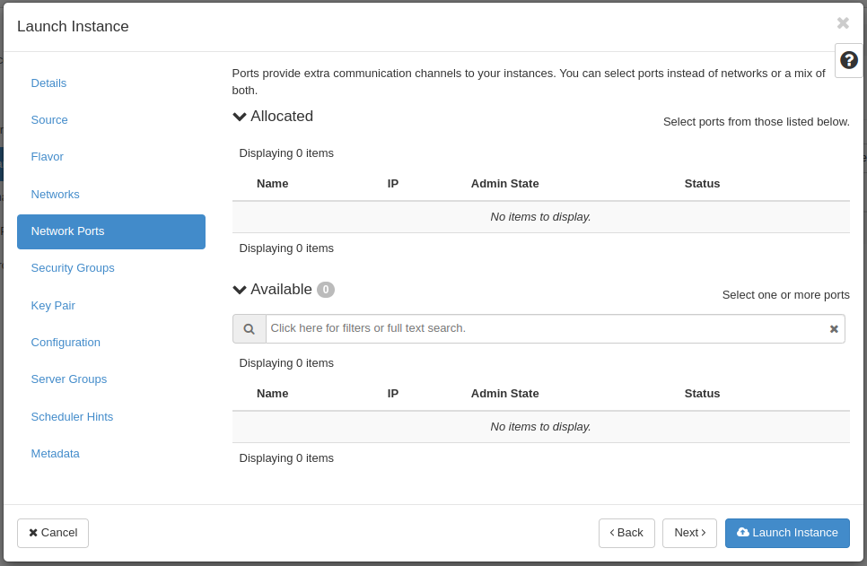

> * click `Next` when done to go to the ___Security Groups___ screen.

##### Step 5: Security Groups

**Security Groups** are an important concept to understand in Openstack.  Security groups define a set of IP filter rules that determine how network traffic flows to and from an instance like a firewall.  The default rule in LakeEffect only allows outbound traffic - no inbound traffic is permitted.

You will need to assign a security group to the instance that allows access via SSH in order to be able to connect to it. This was explained previously in the [Security Groups](#security-groups) section.

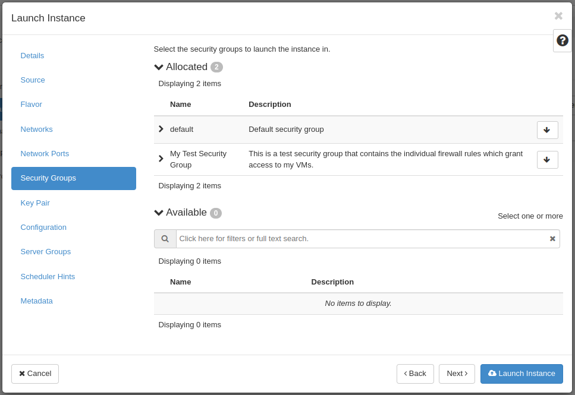

!!! Tip
    Security groups act at the instance level and can be changed after instance creation.

> * click `Next` when done to go to the ___Key Pair___ screen.

##### Step 6: Key Pair

**Key Pair** allows you to SSH into your instance.  You may select an existing key pair, import a key pair you've already created (see the previous section on [Key Pairs](#keypairs) ), or generate a new key pair from this tab.

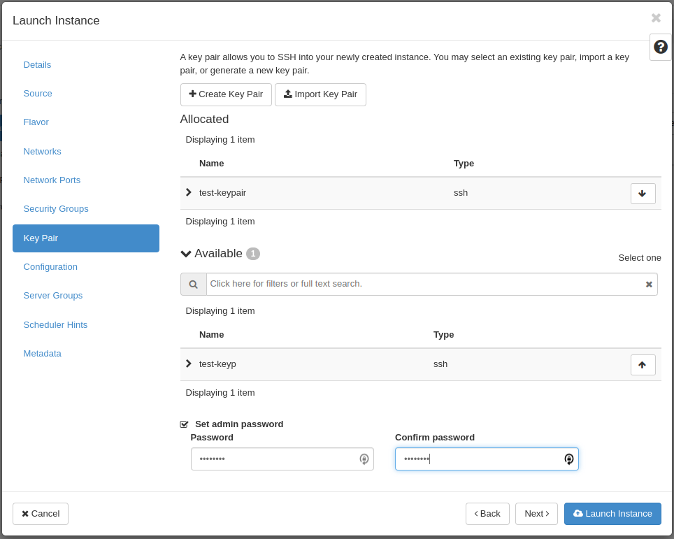

> * click `Next` when done to go to the ___Configuration___ screen.

##### Step 7: Configuration

This tab allows you to script certain configuration details when an instance is launched.  Please click the question mark icon on this tab for more details.  This is for advanced users only.

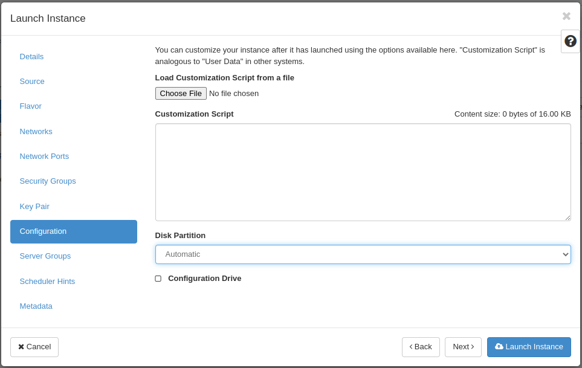

Some users may want to partition the root disk of an instance in a specific way.  To do this, change the Automatic to Manual under Disk Partition and you will be prompted to setup the partitions when the instance is launched.

### Logging in to your Instance

Once your instance has booted up, the only way to connect to them is using SSH with the keypair that you selected when you created the instance. You also need to make sure that you have a security group that allows ssh in from your IP address.

!!! Danger "Do not open unecessary ports"
    You should only open the **bare minimum** ports and to the **smallest range** of IP addresses needed. The more ports that are open the more susceptible your instance
    is to compromise. CCR will shut down insecure instances.  If you'd like to make your instance available to all UB networks, contact [CCR Help](../help.md) for the list of current UB networks.
