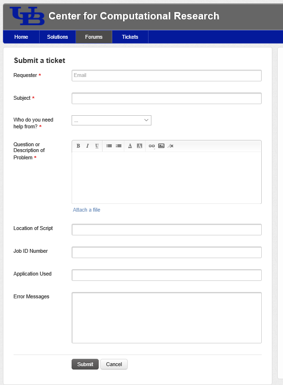

# CCR Help  

CCR staff provide the majority of support to users via email utilizing our [help desk portal, Freshdesk](https://ubccr.freshdesk.com).  This documentation site provides reference documents, how-to guides, and links to tutorials.  

The fastest way to receive technical assistance from our team of system administrators and computational scientists is to submit a ticket through the [CCR Help Desk Portal](https://ubccr.freshdesk.com) or by sending an email to ccr-help_at_buffalo.edu which automatically creates a ticket for you.

**Response times:**  Urgent requests sent during regular business hours are often able to be handled within several hours. One of our staff members will respond within 3 business days (often less) to requests for other non-urgent matters. Our system administrators rotate through an on-call schedule for weekends and non-business hours to handle emergency service outages.

Please do NOT email our staff members directly.  We rotate ticket duties during business hours to balance our workloads so it's important to have all requests in our ticketing system.  The first available staff member with the proper skillset will respond to you.  We make every effort to provide you with assistance in a timely manner.  

!!! Note     
    **Regular Business Hours:** Monday-Friday 8am-4pm EST   
    **Weekends, Holidays* & After Hours Support:** Emergency assistance provided for major service outages only  
    *CCR follows the [University at Buffalo holiday calendar](https://www.buffalo.edu/administrative-services/ub-calendar.html)   

**Alerts & Important Notices:** We post [alerts](https://ubccr.freshdesk.com/support/discussions/forums/5000120071) and [downtime schedules](https://ubccr.freshdesk.com/support/discussions/forums/5000296650) in the help desk portal, on [Twitter](https://twitter.com/ubccr), and in [Slack](#slack).  There is the ability to set notifications for any/all of these services so you never miss an important announcement.  

## CCR Help Portal  

The Freshdesk help portal provides CCR users and staff the ability to manage requests for support, share documentation, post alerts & important notices, and collaborate as a community in the forums.  

### Sign Up for CCR Help Portal  

To access the full functionality of the [CCR Help Desk Portal](https://ubccr.freshdesk.com), users will need to register for an account.  You do not need to use your UB email address for this, but please make sure to enter your UB username so we can associate your help desk account with your CCR account.  Click the `Sign Up` button at the top right of the [help desk portal homepage](https://ubccr.freshdesk.com/support/home) and fill out the registration form.  Those fields marked with a red asterisk are required while the others are optional.  

!!! Tip    
    You do not need to register for a portal account to submit tickets to CCR Help.  Simply email ccr-help_at_buffalo.edu and a ticket will be auto-generated for you.  Reply back to CCR staff via email to update your ticket.  

### Login to CCR Help Portal  

Once you sign-up for a portal account, you can login and access all the features of the help desk portal.  You will be able to access any tickets you've previously submitted and check the status of any open tickets you have.  You can see which CCR staff member is working on your ticket, add more details to the ticket, and even close the ticket if you feel like your question has been answered.  To login, click the `Login` button at the top right of the [help desk portal homepage](https://ubccr.freshdesk.com/support/home)

!!! Warning  
    This portal account is separate from your UB or CCR accounts.  The username for this portal is the email address you used to setup the account.   

### Create new support ticket  

Though users can continue to submit tickets via email to CCR Help, we encourage everyone to fill out the ticket submission form in the portal.  The more information you can provide to our staff, the faster we will be able to help with your problem.  When using the submission form, users can include photos (such as screenshots of errors) and attach files.  

Below is a screenshot of the form on our help portal for submitting tickets.  Anything marked with a red asterisk is required; however please provide as much information as possible:  

   

**Who do you need help from?**  Please select either ccr-help or xdmod-help so your question is routed to the correct team.

!!! Danger  
    **DO NOT INCLUDE ANY PERSONALLY IDENTIFIABLE INFORMATION (such as social security numbers) OR PASSWORDS!**  

### Replying to ticket responses  

 You will receive an automated email when a new ticket is received indicating the ticket number and a link to view it online in the portal.  To view in the portal, you will need to sign-up for a portal account, [as described above](#sign-up-for-ccr-help-portal).  If you don't wish to do this, simply reply via email to the CCR support agent's questions.  

### Viewing ticket status  

Users logged into the portal have the ability to view information about their tickets.  Click on the `Tickets` link in the top menu and then click on the ticket you'd like to view.  You will see all correspondence you've sent and all replies by CCR staff.  You will also see which staff member has been assigned the ticket and what the status of the ticket is.  Within this section, you can reply to the ticket and provide additional information to CCR staff.  By clicking on the icon that resembles a person and plus sign, you can add additional email addresses to receive ticket information.  This is especially helpful when faculty ask for help on behalf of a student or external colleague.  If you feel your ticket has been resolved, you can close it yourself by clicking on the checkmark icon.  

### Previously submitted tickets  

Users can look at tickets they've previously submitted that have been resolved or closed.  Click on the `Tickets` link in the top menu and click on the arrow next to `All Tickets` to change the list to show only `Resolved/Closed` tickets or `Open/Pending` tickets.  

!!! Tip  
    Though you can reply to a closed ticket, we would appreciate it if users would only do this if the original problem has not been solved.  If you have a new problem or are seeing the original problem crop up again, please open a new ticket.  

When searching the knowledge base, if a user is logged in, previously submitted tickets are also searchable.  You will notice not only knowledge base article matches but also matches to your tickets will be listed if the search criteria are met.

### Surveys  

When your tickets are closed (either by you or by a CCR support agent), you will receive an email indicating this.  Included in the email is a request for feedback on your experience.  We value your opinion and aim to provide the best support possible to all users.  If you'd like to let us know what you think, simply click on the icon that best represents your experience: awesome, just okay, or not good.  The link will direct you to a page that you can add more details on your experience or just click the `Submit` button to send the survey.  If you close the ticket yourself, you will be presented with the experience icons in the support portal.  Click on the one you feel represents your experience and you will be given an opportunity to enter comments before submitting the survey.  Thank you very much for providing us feedback and we hope we can meet your expectations for excellent and responsive support!  

## Slack  

CCR staff are also available on Slack to handle basic questions and update users on system issues or changes.  While we can't guarantee immediate response times, we are generally available during regular business hours Monday - Friday 8am-4pm.  If your questions involve a lot of time or investigation on our part, we will ask you to submit a ticket so that we can properly prioritize the request.  Anyone with a UB email address can join the CCR slack organization using [this invite](https://join.slack.com/t/ubccr-help/shared_invite/zt-qt0clqap-9TsWK~DRL26lGgPRDYfWfA).  External CCR users, please contact CCR Help and we'll gladly invite you!  
