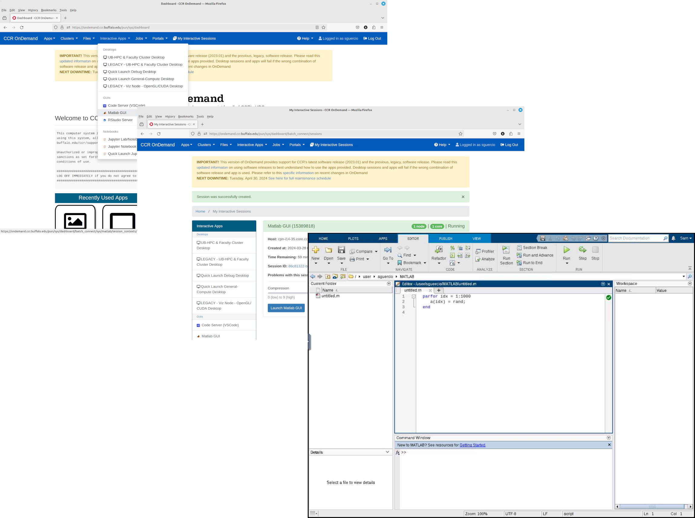
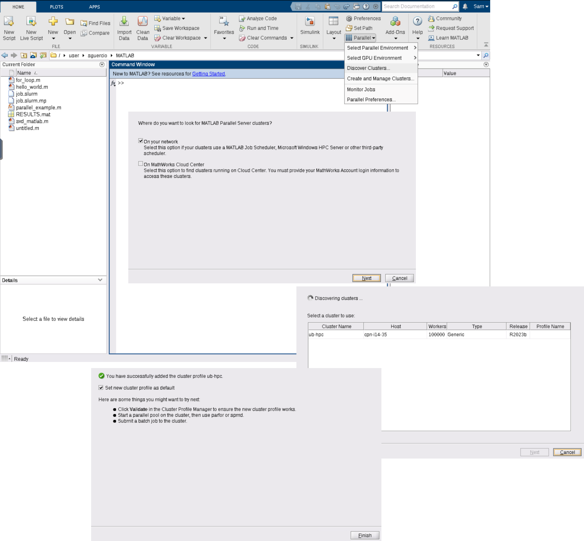

# MATLAB on the HPC Clusters

UB has a sitewide academic license for MATLAB along with all the toolboxes and CCR provides a few versions of MATLAB on our HPC Systems.
 
There are a few different methods for running MATLAB on CCR HPC Systems and the method you chose depends on the type of MATLAB calculatons you with to run. This guide will focus on the main methods in which users would run MATLAB at CCR.
These Methods include:

- Running MATLAB GUI though OpenOndemand
- Running MATLAB batch jobs on the Clusters through Slurm
- Running MATLAB interactively on the command line
- Using MATLAB Parallel Compute Server to submit jobs from within Matlab

This guide does not give information on using MATLAB itself, it is assumed that the audience is already familiar with using it. If you are looking for specific MATLAB related info their documentation is located [here](https://www.mathworks.com/help/matlab/).

## Running MATLAB GUI though OpenOndemand 

The easiest way to use MATLAB on the HPC clusters is through the [CCR Ondemand Web Interface](../portals/ood.md). This method provided a more interactive use of MATLAB but requires a hands on approach. If you are looking for something more automated and scripted see below [Running MATLAB batch jobs on the Clusters through Slurm](#running-matlab-batch-jobs-on-the-clusters-through-slurm)

To begin a session, click on "Interactive Apps" and then "MATLAB GUI". By default, MATLAB sessions are allocated 1 CPU, 2.8GB of RAM and 24 hours wall time (run time). You can override the defaults, however unless you are sure that your script has been explicitly parallelized using, for example, the Parallel Computing Toolbox (see below) leave the "Number of cores" set to 1 . Click "Launch" and then when your session is ready click "Launch MATLAB GUI". Note that the more resources you request, the more you will have to wait for your session to become available.




## Running MATLAB interactively on the command line

You can run MATLAB interactively from the command line either by submitting an [interactive job](../hpc/jobs.md/#interactive-job-submission) through Slurm and logging in to the allocated compute node or
if you need to use MATLAB to edit and test your script you can run it on one of the CCR login node. **NOTE:** The login nodes are a shared resource and have resource limits in place so once you hit one if the limits your session will be terminiated. This use case is only for quick testing or verification that requires very little resources and time.

!!! Warning "X11 Forwarding"
    CCR does not allow X Windows forwarding on our Compute nodes or Login nodes so the Graphical MATLAB is not available with these methods.

### Running MATLAB using an interacive job

Here is an example of how to submit an interactive job to run MATLAB from the command line
```
$ salloc --qos=general-compute --partition=general-compute --job-name "Interactive_Matlab" --cpus-per-task=1 --ntasks=1 --time=01:00:00
salloc: Pending job allocation 15395595
salloc: job 15395595 queued and waiting for resources
salloc: job 15395595 has been allocated resources
salloc: Granted job allocation 15395595
salloc: Waiting for resource configuration
salloc: Nodes cpn-i15-04 are ready for job
$ module load matlab/2023b
$ matlab -singleCompThread -nodisplay -nosplash
Opening log file:  /tmp/java.log.7975

                                                                                                           < M A T L A B (R) >
                                                                                                 Copyright 1984-2023 The MathWorks, Inc.
                                                                                            R2023b Update 4 (23.2.0.2428915) 64-bit (glnxa64)
                                                                                                             October 23, 2023
To get started, type doc.
For product information, visit www.mathworks.com.
 
>> fprintf('Hello world.\n')
Hello world.
```


## Running MATLAB batch jobs on the Clusters through Slurm

### Running a Serial MATLAB Job

A serial MATLAB job is one that requires only a single CPU-core. Here is an example of a trivial, one-line serial MATLAB program (`hello_world.m`):

```
cat hello_world.m
fprintf('Hello world.\n')
```

The Slurm script (`job.slurm.sp`) below can be used for this case:

```
#!/bin/bash
#SBATCH --job-name=matlab        		# create a short name for your job
#SBATCH --qos=general-compute			# qos job will run under 
#SBATCH --partition=general-compute		# partition to run on 
#SBATCH --nodes=1                		# node count
#SBATCH --ntasks=1               		# total number of tasks across all nodes
#SBATCH --cpus-per-task=1        		# cpu-cores per task (>1 if multi-threaded tasks)
#SBATCH --mem-per-cpu=4G         		# memory per cpu-core (4G per cpu-core is default)
#SBATCH --time=00:01:00          		# total run time limit (HH:MM:SS)
#SBATCH --mail-type=all          		# send email on job start, end and fault
#SBATCH --mail-user=<testuser>@buffalo.edu 	# valid email for Slurm to send notifications

module purge
module load matlab/2023b

matlab -singleCompThread -nodisplay -nosplash -r hello_world
```

By invoking MATLAB with **-singleCompThread -nodisplay -nosplash**, the GUI is suppressed as is the creation of multiple threads. To run the MATLAB script, simply submit the job to the scheduler with the following command:

```
$ sbatch job.slurm.sp
Submitted batch job 15390684
```

After the job completes, view the output with ```cat slurm-<jobid>.out:```

```
$ cat slurm-15390684.out
Opening log file:  /tmp/java.log.24391

                            < M A T L A B (R) >
                  Copyright 1984-2023 The MathWorks, Inc.
             R2023b Update 4 (23.2.0.2428915) 64-bit (glnxa64)
                              October 23, 2023

 
To get started, type doc.
For product information, visit www.mathworks.com.
 
Hello world.
```

### Running a Multi-threaded MATLAB Job with the Parallel Computing Toolbox

Most of the time, running MATLAB in single-threaded mode (as described above) will meet your needs. However, if your code makes use of the Parallel Computing Toolbox (e.g., parfor) or you have intense computations that can benefit from the built-in multi-threading provided by MATLAB's BLAS implementation, then you can run in multi-threaded mode. One can use up to all the CPU-cores on a single node in this mode. 

For Multi-node jobs you will need to use the [MATLAB Parallel Server](#running-multi-node-jobs-using-matlab-parallel-server), you should always use #SBATCH --nodes=1 for Multi-threaded and Serial calculations.


Here is an [example](https://www.mathworks.com/help/parallel-computing/interactively-run-a-loop-in-parallel.html) from MathWorks of using multiple cores (`for_loop.m`):

```
$ cat for_loop.m 
poolobj = parpool;
fprintf('Number of workers: %g\n', poolobj.NumWorkers);

tic
n = 200;
A = 500;
a = zeros(n);
parfor i = 1:n
    a(i) = max(abs(eig(rand(A))));
end
toc
```

The Slurm script (`job.slurm.mp`) below can be used for this case:

```
$ cat job.slurm.mp 
#!/bin/bash
#SBATCH --job-name=matlab-mp                    # create a short name for your job
#SBATCH --qos=general-compute                   # qos job will run under 
#SBATCH --partition=general-compute             # partition to run on 
#SBATCH --nodes=1                               # node count
#SBATCH --ntasks=1                              # total number of tasks across all nodes
#SBATCH --cpus-per-task=4                       # cpu-cores per task (>1 if multi-threaded tasks)
#SBATCH --mem-per-cpu=4G                        # memory per cpu-core (4G per cpu-core is default)
#SBATCH --time=00:01:00                         # total run time limit (HH:MM:SS)
#SBATCH --mail-type=all                         # send email on job start, end and fault
#SBATCH --mail-user=<testuser>@buffalo.edu      # valid email for Slurm to send notifications

module load matlab/2023b

matlab -nodisplay -nosplash -r for_loop
```

```
$ sbatch job.slurm.mp 
Submitted batch job 15391013
```

```
$ cat slurm-15391013.out
Opening log file:  /tmp/java.log.47411

                            < M A T L A B (R) >
                  Copyright 1984-2023 The MathWorks, Inc.
             R2023b Update 4 (23.2.0.2428915) 64-bit (glnxa64)
                              October 23, 2023

 
To get started, type doc.
For product information, visit www.mathworks.com.
 
Starting parallel pool (parpool) using the 'Processes' profile ...
Connected to parallel pool with 4 workers.
Elapsed time is 31.030224 seconds.
Parallel pool using the 'Processes' profile is shutting down.
```

Note that **-singleCompThread** does not appear in the Slurm script in contrast to the serial case. One must tune the value of **--cpus-per-task** for optimum performance. Use the smallest value that gives you a significant performance boost because the more resources you request the longer your queue time will be.

By default MATLAB will restrict you to 12 worker threads. You can override this when making the parallel pool with the following line, for example, with 24 threads:

```
poolobj = parpool('local', 24);
```

!!! Note
    If you use more than one thread then make sure that your code can take advantage of all the CPU-cores. The amount of time that a job waits in the queue is proportional to the requested resources. Furthermore, your fairshare value is decreased in proportion to the requested resources. So if you are requesting the resources for a Parallel execution and your code is not designed to take advantage of it then you are wasting CPU cycles that other users can utilize as well as unnecessarily inflating your fairshare score and lowering your job priority.


## Running Multi node jobs Using Matlab Parallel Server

MATLAB Parallel Server lets you scale MATLAB programs to use multiple nodes in clusters. MATLAB Parallel Server supports batch jobs, interactive parallel computations, and distributed computations with large matrices. MATLAB Parallel Server runs your programs by submitting jobs to CCR's Slurm scheduler. 


### Configuring Slurm Integration on CCR MATLAB (Command Line)

In order to use MATLAB Parallel Server you need to create a Cluster Profile, the easiest way to do this is to log onto the CCR login nodes start MATLAB and then run configCluster: 

```
$ module load matlab/2023b
$ matlab -singleCompThread -nodisplay -nosplash
Opening log file:  /tmp/java.log.54427

                                                                                                           < M A T L A B (R) >
                                                                                                 Copyright 1984-2023 The MathWorks, Inc.
                                                                                            R2023b Update 4 (23.2.0.2428915) 64-bit (glnxa64)
                                                                                                             October 23, 2023

 
To get started, type doc.
Foe product information, visit www.mathworks.com.
 
>> configCluster
Complete.  Default cluster profile set to "ub-hpc".
>> 
```

This loads the default Slurm Values to create an initial Cluster profile called ub-hpc.

Once you have the default profile, you will want to customize the configuration with specfic user values such as user email for example.

This is accomplished right within MATLAB.

- Get a handle to the cluster
```
>> c = parcluster;
```
- Display current properties
```
>> c.AdditionalProperties

ans = 

  AdditionalProperties with properties:

             AccountName: ''
    AdditionalSubmitArgs: ''
                Clusters: 'ub-hpc'
              Constraint: ''
            EmailAddress: ''
             EnableDebug: 0
                 GPUCard: ''
             GPUsPerNode: 0
               MemPerCPU: '8gb'
               Partition: 'general-compute'
            ProcsPerNode: 0
        QualityOfService: 'general-compute'
    RequireExclusiveNode: 0
             Reservation: ''
                WallTime: ''

>> 
```
- Change user Email Address
```
>> c.AdditionalProperties.EmailAddress = 'testuser@buffalo.edu';
```
- Save the changes
```
>> c.saveProfile
```

This should be enough to submit a test job to CCR's HPC Clusters from MATLAB. You can create multiple Cluster Profiles with different settings so you don't have to always modify the default.

### Submitting a test Job from MATLAB to CCR Clusters

Here is an example parallel MATLAB job that is submitted to CCR's HPC Clusters:

Let’s use the following example for a parallel job, which is saved as (`parallel_example.m`)

```
$ cat parallel_example.m 
function [sim_t, A] = parallel_example(iter)
 
if nargin==0
    iter = 8;
end
 
disp('Start sim')
 
t0 = tic;
parfor idx = 1:iter
    A(idx) = idx;
    pause(2)
    idx
end
sim_t = toc(t0);
 
disp('Sim completed')
 
save RESULTS A
 
end
```

From MATLAB:

```
>> c = parcluster;

>> job = c.batch(@parallel_example, 1, {16}, 'Pool',4,'CurrentFolder','.');    

additionalSubmitArgs =

    '--ntasks=5 --cpus-per-task=1 --ntasks-per-core=1 --mem-per-cpu=8gb --qos=general-compute --clusters ub-hpc -p general-compute --mail-type=ALL --mail-user=testuser@buffalo.edu'
```

You can check the Slurm job state from within MATLAB:
```
>> job.State

ans =

    'queued'

>> 

```
After the job is completed the state will be Finished and you can check the output:

```
>> job.State

ans =

    'finished'

>> job.fetchOutputs{:}

ans =

    8.4850

>> 

```

The job ran in 8.485 seconds using four workers.  **Note** that these jobs will always request N+1 CPU cores, since one worker is required to manage the batch job and pool of workers. 
For example, a job that needs eight workers will request nine CPU cores.

### Configuring Slurm Integration on CCR MATLAB (GUI)

Configuring the Slurm integration using the MATLAB GUI is pretty straight forward. 

- Start up MATLAB through an Ondemand Session as described [here](#running-matlab-gui-though-openondemand)

- From the MATLAB Session Click on `Parallel` -> `Discover Clusters`

- Leave the check box in the `On your Network` and click `Next`

- Highlight the default `ub-hpc` clister and click `Finish`



You now have a default Cluster Profile that should work out of the box, but you will want to change some of the default settings such as user email settings.

To make changes to the default Cluster Profile:


- From the MATLAB Session Click on `Parallel` -> `Create and Manage Clusters`

- Click on the ub-hpc Cluster Profile and Click `Edit`

- Make your changes and click `Done`


### Configuring Remote Slurm Integration (GUI)

It is possible to configure your local MATLAB to submit jobs to CCR from your Desktop or Workstation. The setup is very similar to Configuring Slurm Integration on CCR MATLAB once you have the correct integration scripts.


NOTE: This proceedure assumes that you have MATLAB R2023b (Currently the only supported Version at CCR) installed on your local machine.

!!! Warning "SSH Key Credentials"
    Submission to the cluster requires SSH credentials.  You will be prompted for username and password or identity file (private key).  The username and location of the private key will be stored in MATLAB for future sessions.


You will need do download the MATLAB CCR Slurm integration script and place them on your local machine in the MATLAB

Download the [CCR Matlab Integration Scripts](https://g-ac407a.8c185.08cc.data.globus.org/R2023b/University-at-Buffalo.zip) and start MATLAB.  The ZIP file should be unzipped in the location returned by calling…

```
>> userpath

ans =

    '/home/testuser/Documents/MATLAB'

>> 

```


Configure MATLAB to run parallel jobs on the cluster by using the configCluster This only needs to be run  once per version of MATLAB.


```
>> configCluster
Username on UB-HPC (e.g. jdoe): >>testuser
Complete.  Default cluster profile set to "ub-hpc R2023b".
>> 

```
You will need to configure your user infomation into the Profile including the location to your public SSH key:

```
>> c = parcluster;
>> c.AdditionalProperties.EmailAddress = 'testuser@buffalo.edu'
>> c.AdditionalProperties.IdentityFile = '/home/testuser/.ssh/private.key'
```

**NOTE:** We recommend setting the RemoteJobStorageLocation to your project space rather than your home directory.

```
c.AdditionalProperties.RemoteJobStorageLocation = '/projects/testusergroup/testuser/Software/MATLAB/Jobs'
```

Save the changes to the profile:

```
>> c.saveProfile
```

Submit a Parallel Test Job:

```
>> job = c.batch(@parallel_example, 1, {16}, 'Pool',4,'AutoAddClientPath',false,'CurrentFolder','.');

additionalSubmitArgs =

    '--ntasks=5 --cpus-per-task=1 --ntasks-per-core=1 --mem-per-cpu=8gb --qos=general-compute --clusters ub-hpc -p general-compute --mail-type=ALL --mail-user=testuser@buffalo.edu'

>> job.State                                                                                         

ans =

    'finished'

>> job.fetchOutputs{:}                                                                               

ans =

    8.6260

>> 
```


More information on MATLAB Parallel Computing can be found here: [MATLAB Parallel Computing Toolbox](https://www.mathworks.com/help/parallel-computing/)


