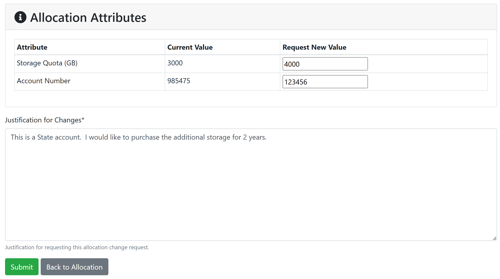
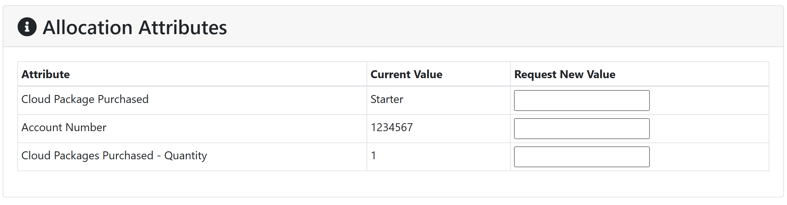

# Processes for Purchasing CCR Services  

For those who wish to purchase additional project storage in the HPC environment, Lake Effect cloud compute credits or storage, or other CCR paid services, CCR tracks this information as allocations in the [ColdFront](../portals/coldfront.md) portal.  Once allocation requests are submitted, CCR will enter the purchase request in Blue Services, UB's iLab service.  Customers will receive email notifications when invoices are ready for approval.  Once the PI approves the invoice, it will be processed for payment.  Refer to this information for how to go about initiating purchases and renewing expiring purchases:

- [HPC Storage](#hpc-storage)  
- [Lake Effect Cloud Credits & Storage](#lake-effect-cloud)  
- [Co-Location Fees](#co-location-fees)  
- [System Administration Fees](#miscellaneous-support-fees) 
- [Using Blue Services for Payments](#processes-for-purchasing-ccr-services) 

## HPC Storage  

Additional storage for shared project directories can be purchased in 1 terabyte (TB) chunks in annual installments.  

### HPC Storage Rates  

**Internal Rates:**

- **_$72 per terabyte per year_**  
- This is an internal rate for internal UB users including academic, research, administrative, and auxiliary units whose originating source of funds is within or flows through the university.  This includes state, RF, UBF, and Faculty Student Association (FSA) funds
- Internal UB users paying with funds other than those listed above are charged an additional fee to cover the processing fee UB charges CCR.  This makes the cost **_$82.76 per TB per year_** 

!!! Notice "RPCI Purchases"  
    Faculty with joint positions at UB and Roswell can only qualify for the UB internal rate if they use UB funds to purchase the storage.  RPCI users should check with RPCI IT for access to the storage allocation RPCI purchased from CCR before making a purchase of their own.

**External Rates:**

- External collaborators, groups and industry partners are charged **_$100/TB per year_**  

!!! Warning  
    We are NOT able to issue refunds should you stop using CCR's storage.  

### How to Initiate an HPC Storage Purchase  

To initiate the purchase of additional project storage, the PI or project owner should login to [ColdFront](https://coldfront.ccr.buffalo.edu) and request an allocation change request.  To do this, click on the file icon next to your allocation for the Project Storage and click on the `Request Change` button.  **Please do not request a date extension**

In the `Allocation attributes` section, please enter:

- What you'd like your storage quota to be.  This is in gigabytes (GB) and we sell in increments of 1000GB (or 1TB).  
- What account number we should bill this purchase to.  

In the `Justification for Changes` box, please include:  

- What type of account are you paying with?  This determines the cost:  
    - UB internal funds: State, RF, UBF, FSA   
    - Other internal funds   
    - External funds    
- If you do not have signatory authority on this account, please let us know who the invoice should be directed to on your behalf  
- If you'd like to purchase the storage for more than one year, you must pay with a State account.  RF will not allow purchases of more than 1 year.  Please indicate how many years you'd like to purchase  

!!! Warning "Please verify grant dates!"  
    We are required to bill for storage in yearly increments.  Please do not provide an account number that is not valid for the entire length of the storage payment as these will be rejected by SPS.  We are not permitted to prorate payments or split charges across accounts to accomodate grants ending in less than 1 year.

Once an allocation change request has been submitted, your request will be processed through Blue Services (iLab).  [See below](#using-blue-services-for-ccr-purchases) for further information on the Blue Services invoice process.  Because billing through Blue Services is only conducted once per month, your quota will be increased at the time of request, not the time of payment.  If payment doesn't go through, you'll be contacted about alternate payment arrangements.  If none are available within 30 days, your quota will be reduced to the previous quota.  

### How to Renew an Existing HPC Storage Purchase  

You will receive automated reminders from ColdFront when your storage allocation is coming up for expiration.  You must [renew your allocation](../portals/coldfront.md#allocation-renewals) to maintain access to the storage.  When going through the allocation renewal process you will not be prompted for updated information.  When processing any purchase renewals, we will use the same account we used for your previous payment.  If you'd like to update this information, you may do so using the [allocation change request](#how-to-initiate-an-hpc-storage-purchase) as described above and changing only the account number or you can contact [CCR Help](../help.md) with your updated information.  

!!! Tip "Multiple Renewals per Year"  
    If you purchase additional storage through the year, your allocation will be set to expire when the next storage purchase is due for renewal.  This may result in multiple reminders to renew your allocation throughout the year.  We apologize for this inconvenience but because we're not able to prorate purchases, we must renew each purchase separately.  If your renewal dates are close together, we will work with you to combine them into one invoice.  

## Lake Effect Cloud  

The on-premise research cloud is a paid service available to UB's researchers and industry customers.  For more information on subscription pricing for this service, please refer [here](../cloud/lake-effect.md#subscriptions). Cloud compute and storage purchases are managed using allocations in [ColdFront](../portals/coldfront.md).  

### Cloud Compute Credits  

Cloud compute credits are billed as packages as described [here](../cloud/lake-effect.md#subscriptions).  To request a package, please request an allocation for the `Lake Effect Cloud` resource in [ColdFront](../portals/coldfront.md).  In the `Justification` box, please include:  

- Which package(s) you'd like to purchase (and quantify, if purchasing multiple packages)  
- What account number to bill  
- What type of account are you paying with?  This determines the cost:  
    - UB internal funds: State, RF, UBF, FSA   
    - Other internal funds   
    - External funds    
- If you do not have signatory authority on this account, please let us know who the invoice should be directed to on your behalf  
- If you'd like to purchase the cloud credits for more than one year, you must pay with a State account.  RF will not allow purchases of more than 1 year.  Please indicate how many years you'd like to purchase  

!!! Warning "Please verify grant dates!"  
    We are required to bill for services in yearly increments.  Please do not provide an account number that is not valid for the entire term of service as these will be rejected by SPS.  We are not permitted to prorate payments or split charges across accounts to accomodate grants ending in less than 1 year.

### Cloud Storage

Each of the cloud compute packages comes with some cloud storage.  If you'd like to purchase additional storage, please request an allocation for the `Lake Effect Cloud Storage` resource in ColdFront.  In the quantity box, enter the number of terabytes of storage you want to purchase (which will be in addition to the storage received with your package).  **If you are paying for this separately from the Lake Effect Cloud packages**, in the `Justification` box, please include: 

- What account number to bill  
- What type of account are you paying with?  This determines the cost:  
    - UB internal funds: State, RF, UBF, FSA   
    - Other internal funds   
    - External funds    
- If you do not have signatory authority on this account, please let us know who the invoice should be directed to on your behalf  
- If you'd like to purchase the cloud storage for more than one year, you must pay with a State account.  RF will not allow purchases of more than 1 year.  Please indicate how many years you'd like to purchase  

### Purchasing increases to existing cloud allocations  

The nature of the cloud environment lends itself to being flexible and often times researchers find they need additional storage or cloud credits outside of their standard annual renewal time.  

**Cloud Compute Credits**  
To request more cloud compute credits, click on the file icon next to your allocation for the Lake Effect Cloud, and click on the `Request Change` button.  **Please do not request a date extension.**  You will have the opportunity to request changes on several allocation attributes: `Account Number`, `Cloud Package Purchased`, and `Cloud Packages Purchased - Quantity` as shown here:

Please modify any you'd like to update and leave all others blank. Refer [here](../cloud/lake-effect.md#subscriptions) for more info on package names and what is included in each package.  Fill in the `Justification for Changes` box and click the `Submit` button.  After this is received, CCR staff will enter this into Blue Services and you'll receive an invoice at the beginning of the following month.  CCR staff will update your cloud allocation(s) at the time of request and you'll receive an email from ColdFront when the additional resources are available to you. If payment doesn't go through, you'll be contacted about alternate payment arrangements.  If none are available within 30 days, your credits will be reduced to the previous amount. 

**Cloud Storage**  
To request a change in your Lake Effect Cloud Storage allocation, click on the file icon next to the allocation, and click on `Request Change.` **Please do not request a date extension.**  You will have the opportunity to request changes on several allocation attributes: `Account Number` and `Storage Quota (TB)` as shown here:   

Please modify any you'd like to update and leave all others blank. Fill in the `Justification for Changes` box and click the `Submit` button.  After this is received, CCR staff will enter this into Blue Services and you'll receive an invoice at the beginning of the following month.  CCR staff will update your cloud allocation(s) at the time of request and you'll receive an email from ColdFront when the additional resources are available to you. If payment doesn't go through, you'll be contacted about alternate payment arrangements.  If none are available within 30 days, your quota will be reduced to the previous amount.

### Renewing cloud purchases  

You will receive automated reminders from ColdFront when your cloud allocations are coming up for expiration.  You must [renew your allocation](../portals/coldfront.md#allocation-renewals) to maintain access to these services.  When going through the allocation renewal process you will not be prompted for updated information.  When processing any purchase renewals, we will use the same account we used for your previous payment.  If you'd like to update this information, you may do so using the [allocation change request](#cloud-compute-credits) as described above and changing only the account number or you can contact [CCR Help](../help.md) with your updated information.  

!!! Tip "Multiple Renewals per Year"  
    If you purchase additional cloud credits or storage through the year, your allocation will be set to expire when the next purchase is due for renewal.  This may result in multiple reminders to renew your allocation throughout the year.  We apologize for this inconvenience but because we're not able to prorate purchases, we must renew each purchase separately.  If your renewal dates are close together, we will work with you to combine them into one invoice.  

## Co-Location Fees  

A one time co-location fee is charged to faculty who purchase compute nodes maintained by CCR. For more details on this service, please [see here](../policies/support.md#hardware-purchase-installation-policy). At the time your compute node(s) is installed, CCR will prepare an invoice in Blue Services for the co-location fee.  You'll be asked to provide an account number at that time.  When the invoice is ready, you'll receive an email from Blue Services with instructions for approving the bill. After payment is made, you'll receive information from CCR staff on how to access your compute node(s). [See below](#using-blue-services-for-ccr-purchases) for further information on the Blue Services invoice process.   

## Supporters Priority Boost  

The supporters priority boost is provided to groups that financially support CCR through annual payments.  See [here](https://www.buffalo.edu/ccr/support/ccr-help/accounts.html#boost) for more details.  This will be entered as an allocation on your project in ColdFront and billed through Blue Services as System Administration support time.  [See below](#using-blue-services-for-ccr-purchases) for further information on the Blue Services invoice process. The account number provided will be listed under the `Allocation Attributes` section of your allocation.  To update this, please the use `Allocation Change Request` button and enter your new account or contact [CCR Help](../help.md) to update it.  [See above](#how-to-initiate-an-hpc-storage-purchase) for more details on this process. 

## Miscellaneous Support Fees  

Additional fees for things such as system administration or developer consulting services will be invoiced through Blue Services.  You'll be asked for an account number and when the invoice is ready, you'll receive an email from Blue Services with instructions for [approving the bill](#invoice-processing).  

## Using Blue Services for CCR Purchases  

CCR utilizes UB's Blue Services (iLab) portal for all purchases.  You may access CCR's iLab core page [here](https://buffalo.ilab.agilent.com/service_center/show_external/6406/center_for_computational_research).  Billing happens once a month, after which you'll receive an invoice through Blue Services with instructions on how to approve your payment.    To login to Blue Services, click the `Sign In` button and choose the `Sign in using University at Buffalo credentials` option.  All UB PIs should have access to this.  If you run into any trouble, please refer to the [Blue Services website](https://www.buffalo.edu/administrative-services/managing-money/fee-development-and-cost-accounting/service-centers/blue-services/blue-services-support.html) for assistance. Their [detailed user guides](https://www.buffalo.edu/administrative-services/managing-money/fee-development-and-cost-accounting/service-centers/blue-services/blue-services-user-guides.html) provide information including logging into Blue Services, approving invoices, and managing cost approvers.  

### Invoice processing  

Once per month, UB will process all invoices CCR has entered into Blue Services that month.  PIs with outstanding invoices will receive an email notification from Blue Services indicating they have an open invoice to approve.  You will need to login to Blue Services to review the invoice to ensure it's accurate and has the correct account number for payment.  You will have the ability to change the account number at that time.  If anything is wrong with the invoice, please follow the instructions on the invoice to resolve the error or contact [CCR Help](../help.md).  You will have 10 days to review and approve the invoice, after which it will be sent for payment.  If payment doesn't go through, you'll be contacted about alternate payment arrangements.  If none are available within 30 days, your quota or access to services will be reduced to the previous amount.  

### External users  

External customers of CCR will need to register for an iLab account in order to receive and process invoices for services.  Please follow the instructions on UB's [Blue Services](https://www.buffalo.edu/administrative-services/managing-money/fee-development-and-cost-accounting/service-centers/blue-services/blue-services-user-guides/registering-with-blue-services-ilab-for-external-users.html) page to complete your registration.  You'll be asked which lab you want to associate with - please search for `Center for Computational Research`.  Your account will require approval, which we're told takes approximately 1 business day.  If you have not received account approval after several days, please contact [CCR Help](../help.md).  

Once your iLab account is ready, we'll be able to prepare invoices for your company.  You'll receive email notifications with instructions when invoices are ready for payment.  Instructions for submitting payments will be included in those communications. 

If you require changes to the services that you're allocated, please contact [CCR Help](../help.md) to initiate that discussion.