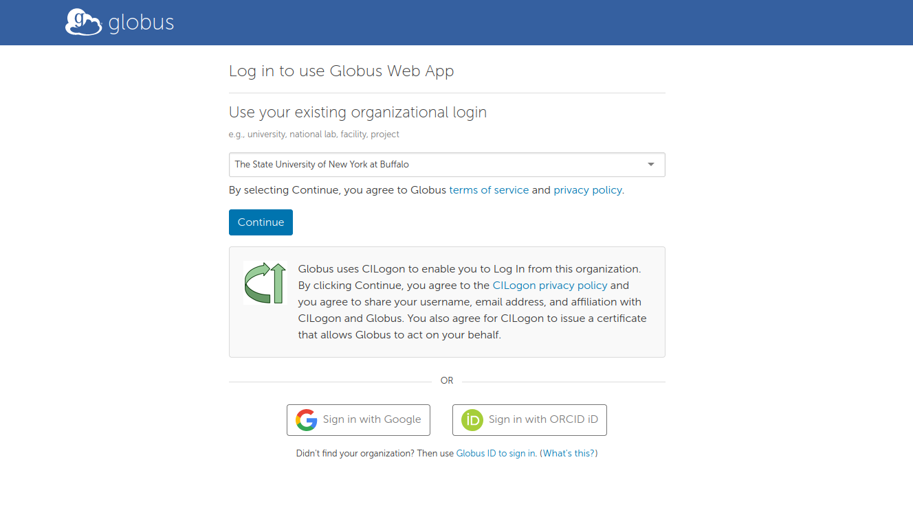
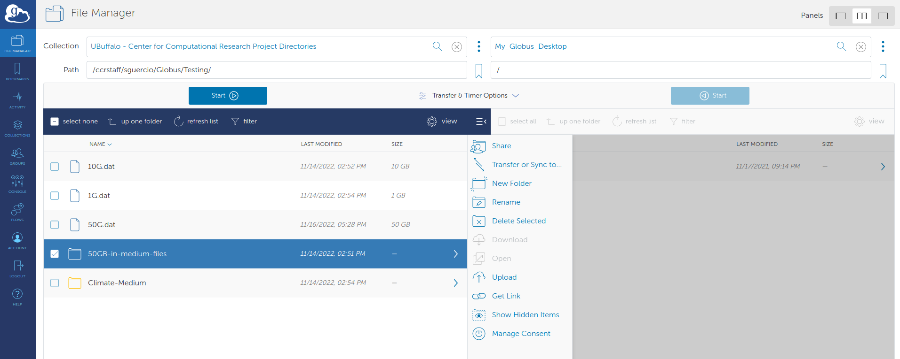

# Data Transfer


CCR supports multiple ways to transfer Data in and out of CCR and the method 
you choose depends on the amount of Data to transfer and the speed of your connection to CCR.
File transfers from a local system can be done through a web-based
application called _Globus_ or through command-line tools such as
secure copy (_scp_), secure ftp (_sftp_) and _rsync_. Some
command-line tools may be unavailable on Windows, though alternative
applications exist. (e.g., Git Bash, FileZilla)


CCR Supported Methods for inbound and outbound Data transfer include:

1. ** [Globus File Transfer Service](#globus-transfers) **

2. ** [Secure Shell Copy (scp/sftp)](#secure-shell-copy) **

3. ** [OnDemand File Manager App](#ondemand-file-manager-app) **

4. ** [Transferring Files with UB Box](#transferring-files-with-ub-box) **

!!! Warning "VPN Required" 
    Access to Secure Shell Copy and OnDemand is restricted to UB and Roswell Park networks
    (either on campus or connected to their VPN services). [See here](../getting-access.md#vpn-access)

**_ * Globus transfers are available from everywhere, You do not need to be on the UB or Roswell Park networks to use Globus._**

---

## Globus transfers

Globus file transfers are typically initiated through an interactive
web application (command-line access to Globus is also available, but
is beyond the scope of this document). Globus addresses deficiencies
in traditional file-transfer mechanisms by automating large data
transfers, resuming failed transfers, distributing large transfers
across multiple servers, and brokering direct transfers between remote
computing centers. Globus performs an MD5-Checksum for transfer verification.

Globus can be used on macOS, Linux, and Windows operating systems and
is CCR's recommended way of transferring files, especially for large amounts of data.

### Globus Web App
To use Globus, go to the [Globus Web App](https://app.globus.org/) and sign in by
selecting "The State University of New York at Buffalo" from the dropdown menu
and by logging in using your UB credentials.

!!! Note "non-UB users:"
    If you are with an institution other than UB, you will need to [create a Globus account](https://www.globusid.org/create) and contact [CCR Help](../help.md) to map your globusid to your CCR account.



CCR storage resources are available in Globus as mapped collections.
You can connect to a CCR endpoint using the "collections"
field in the Globus web interface and searching for `UBuffalo - Center for Computational Research`. 

CCR Currently has 3 Collections:

* UBuffalo - Center for Computational Research Project Directories
* UBuffalo - Center for Computational Research Home Directories
* UBuffalo - Center for Computational Research Global Scratch

Log into the endpoint using your UB account credentials (not your CCR account). The system will map your @buffalo.edu account to your local CCR user 
and you will have access to the same directories that you do when logged into any other CCR system.

You can download single files through the browser but to take advantage of the benefits of Globus
you will need to do endpoint to endpoint transfers. To do this, 
you must configure a local endpoint in order to transfer files to/from
your local computer. You can easily set up a Globus endpoint by
installing [Globus Connect
Personal](https://www.globus.org/globus-connect-personal) and setting up a personal endpoint.

Using the web app, connect your local workstation endpoint with the
CCR endpoint and transfer files easily using the Globus
GUI.




### Guest Collections (Globus Shared Endpoints)

Using a Guest Collection (also known as a "Shared Endpoint"), You can share
any file or folder that you have access to with anyone who
has a Globus account. This is particularly useful for external collaborations in which
data sharing is necessary.  

Detailed information on creating Guest Collections is available [at
docs.globus.org](https://docs.globus.org/how-to/share-files/).


## Secure Shell Copy

Command line terminal access is provided via the SSH protocol, while command line file transfer 
is available with sftp (Secure File Transfer Protocol) and scp (Secure Copy).
The ssh, scp and sftp client software should be available on all Linux distributions 
as part of the operating system installation.  

*to/from the Frontends:*

* This would be for simple file transfers that can complete within a 15 minute timeframe  

*from the Compute Nodes:*

* This would be for file transfers that can complete within a 72 hour window
* This will only work for outbound transfers because compute nodes are not exposed externally
* You must have an active job with an allocated compute node to get access to them

!!! Note "SSH Keys required"
    Users must use SSH keys to connect to CCR servers using SSH/SFTP/SCP.  Please [follow these instructions to upload your public SSH key](../portals/idm.md#ssh-keys) to the CCR identity management portal before attempting to connect to CCR's servers.  

### Command line SCP

The Secure Copy utility, `scp`, can send data to and fetch data
from a remote server.

In the examples here, replace `<path-to-file>` with the path of the
file you wish to copy, `<username>` with your CCR
username, and `<target-path>` with the full path to the directory you
would like to send the file to.

```bash
# Copying files from a local workstation to CCR Frontend Servers

scp -i <path-to-yourSSHKey> <path-to-file> <username>@vortex.ccr.buffalo.edu.edu:<target-path>
```

!!! Note
    For any of the SSH based transfer methods, If you are running an SSH Agent locally that manages your private key you will not need to specify the key in the command line.

Windows users can access scp through PowerShell or [Git bash](https://gitforwindows.org/) or using a GUI application like [FileZilla](#filezilla).

For more information on secure copy take a [look at some of our listed
resources](#more-reading) or consult the scp manual page.

### Interactive file transfer with SFTP

The `sftp` utility is an interactive alternative to `scp` that allows
multiple, bi-directional transfer operations in a single
session. Within an sftp session, a series of domain-specific file
system commands can be used to navigate, move, remove, and copy data
between a local system and CCR resources.

```bash
sftp <username>@vortex.ccr.buffalo.edu
```

We can then use various commands to traverse and manipulate both local
and remote file systems.

Command | Function | Example
--------|--------------------------------------------------------------------|----------
cd      | Changes the directory of the remote computer                       | cd remote_directory
lcd     | Changes the directory of the local computer                        | lcd local_directory
ls      | Lists the contents of the remote directory                         | ls
lls     | Lists the contents of the local directory                          | lls
pwd     | Prints working directory of the remote computer                    | pwd
lpwd    | Prints working directory of the local computer                     | lpwd
get     | Copies a file from the remote directory to the local directory     | get remote_file
put     | Copies a file from the local directory to the remote directory     | put local_file
exit    | Closes the connection to the remote computer and exits the program | exit
help    | Displays application information on using commands                 | help

Windows users can access scp through PowerShell or [Git bash](https://gitforwindows.org/) or using a GUI application like [FileZilla](#filezilla).

For more information on sftp [check out some of our listed
resources](#more-reading) or consult the sftp manual page.

### Rsync

While `scp` is useful for simple file copy operations, the `rsync`
utility can be used to synchronize files and directories across two
locations. This can often lead to efficiencies in repeat-transfer
scenarios, as rsync only copies files that are different between the
source and target locations (and can even transfer partial files when
only part of a file has changed). This can be very useful in reducing
the amount of copies you may perform when synchronizing two
datasets.

!!! Warning
    You will need to set the remote shell command to ssh. The default rsh is not secure and will not work at CCR.

In the examples here, replace `<path-to-file>` with the path of the
file you wish to copy, `<username>` with your CCR
username, and `<target-path>` with the full path to the directory you
would like to send the file to.

```bash
# Synchronizing from a local workstation to CCR

rsync -e 'ssh -i <path-to-yourSSHKey>' -r <path-to-directory> <username>@vortex.ccr.buffalo.edu:<target-path> 
```

**rsync** is not available on Windows by default, but [may be installed
individually](https://www.itefix.net/cwrsync) or as part of [Windows
Subsystem for Linux
(WSL)](https://docs.microsoft.com/en-us/windows/wsl/install-win10).

For more information on rsync [check out some of our listed
resources](#more-reading) or consult the rsync manual page.

### Filezilla

There are additional software products available for Windows, Mac, and Linux distributions
that provide secure drag and drop interfaces for file transfer such as Filezilla which can be installed from [here](http://www.buffalo.edu/ubit/service-guides/software/downloading/windows-software/managing-your-software/filezilla.html).

Once installed, follow these steps to connect to CCR resources with Filezilla:

** Adding CCR as a site: **

!!! Note "SSH Keys Required"
    You will need the SSH Key setup in FileZilla so that it does not try and use a password. CCR will only allow SSH key authentication. 

If you are using an SSH Agent to manage your SSH Keys , Verify that your **SSH_AUTH_SOCK** environment variable has been set by the SSH Agent.

```bash
$ echo $SSH_AUTH_SOCK
/run/user/1000/keyring/ssh
```
Open the Filezilla Application

> *  From the File dropdown click `Site Manager...`
 
This will popup the Site Management Window

> * Click `New Site`
> * Rename the site from the default New Site to "CCR"

> * Enter the Following Settings:

      - Protocol: SFTP - SSH File Transfer Protocol
      - Host: vortex.ccr.buffalo.edu
      - Login Type: Normal
      - Username: your-ccr-username
      - Password: Leave Blank

> * Click `OK` to add the site.

After the Site has been added you can connect to CCR by selecting it from the Site Manager Window and clicking `Connect`

**_If you are NOT using an SSH Agent to manage your SSH Keys:_**

Open the Filezilla Application

> * From the Edit dropdown select `Settings` 
> * Go to the `SFTP` Page
> * Click `Add key file...`
> * Navigate to your CCR Private SSH Key and click `Open`

Filezilla will prompt to convert the key into a compatible format

> * Click `yes` and select a place and name for the converted key

You will now see the key in the list of SSH keys

> *  From the File dropdown click `Site Manager...`
 
This will popup the Site Management Window

> * Click `New Site`
> * Rename the site from the default New Site to "CCR"

> * Enter the Following Settings:

      - Protocol: SFTP - SSH File Transfer Protocol
      - Host: vortex.ccr.buffalo.edu
      - Login Type: keyfile
      - Username: your-ccr-username
      - Key file: Navigate to the Key you converted in previous steps

> * Click `OK` to add the site.

After the Site has been added you can connect to CCR by selecting it from the Site Manager Window and clicking `Connect`

## OnDemand File Manager App

* This is browser based for simple transfers and not recommended for large amounts of data  

This information is available in our [Open OnDemand Documentation](../portals/ood.md)


## Transferring Files with UB Box

The UB Information Technology group has recommended using ftps (secure ftp) to transfer files to/from UB Box because 
it is considerably faster than the alternatives.  To use "ftps" (i.e. ftp over SSL), CCR users can use "lftp" on a CCR 
login node (if the transfer will take less than 15 minutes), by running an interactive job or using an OnDemand desktop 
to run for longer periods of time. Prior to doing so, UB users must create an FTP password within Box.  

Please refer the UBit documentation for Using FTP with UBbox found [Here](https://www.buffalo.edu/content/www/ubit/information-for-it-staff-pw/box/ftp.html)

Once your UBbox ftp password is setup, you can transfer files from CCR to UB Box using SFTP. 

To do this, SSH into a CCR Login node and use the following steps substituting in your information:

```bash
$ lftp
lftp :~> set ftps:initial-prot ""
lftp :~> set ftp:ssl-force true
lftp :~> set ftp:ssl-protect-data true
lftp :~> open ftps://ftp.box.com:990
lftp ftp.box.com:~> user UBID@buffalo.edu
Password: _enter_your_box_ftp_password_here_
lftp UBID@buffalo.edu@ftp.box.com:~> ls
drwx------ 1 owner group 0 Mar 24 2020 Your_files
 [...]

lftp UBID@buffalo.edu@ftp.box.com:~> cd somedir
lftp UBID@buffalo.edu@ftp.box.com:/somedir~> get somefile
16063 bytes transferred
lftp UBID@buffalo.edu@ftp.box.com:/somedir~> exit
$ lftp
```

Additional information from Box on using Using Box with FTP or FTPS along with examples is [Here]( https://support.box.com/hc/en-us/articles/360043697414-Using-Box-with-FTP-or-FTPS)


## More reading

* [Indiana University Tutorial on SFTP](https://kb.iu.edu/d/akqg)
* [A Cloud Guru's Tutorial on SSH and SCP](https://acloudguru.com/blog/engineering/ssh-and-scp-howto-tips-tricks)
* [ssh.com's Tutorial on SCP and SFTP](https://www.ssh.com/ssh/sftp/)
* [Linuxize's Tutorial on Rsync](https://linuxize.com/post/how-to-use-rsync-for-local-and-remote-data-transfer-and-synchronization/)
* [Ubuntu's Documentation on Rsync](https://help.ubuntu.com/community/rsync)


---
