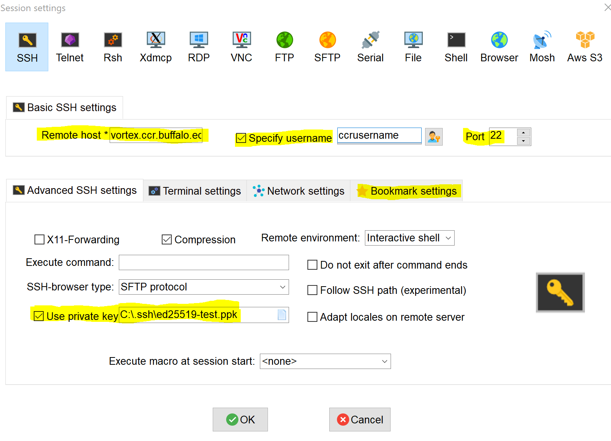
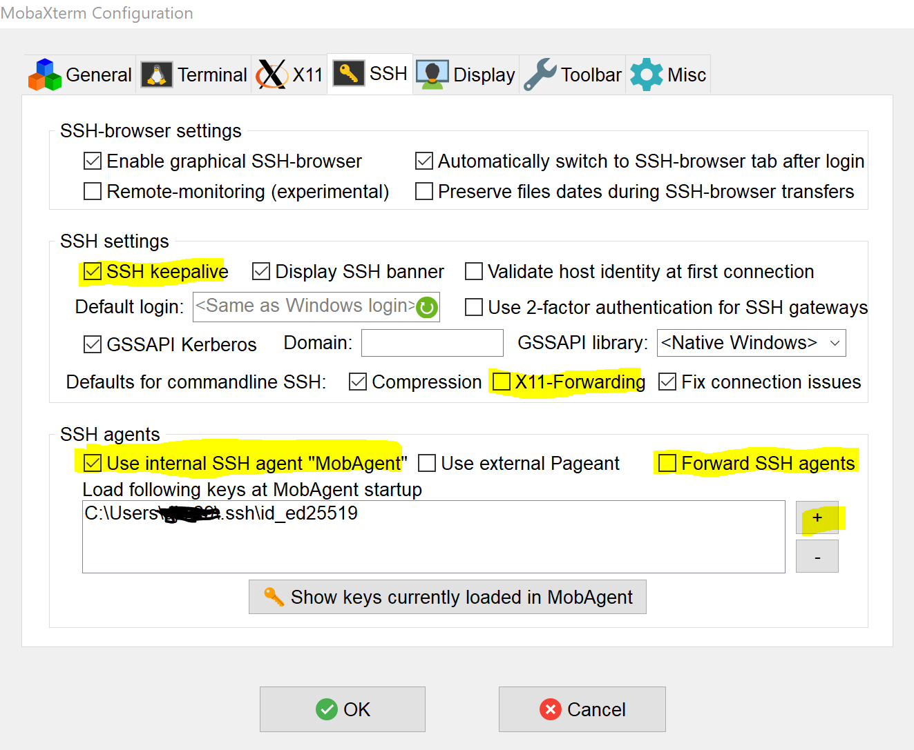

# Login Node

Users accessing CCR's HPC resources will be connected to a login node. A login
node is a outward facing node within CCR's HPC environment that users can connect
to from their local machines. Once on a login node, users can perform a limited
number of tasks:

- Edit files
- Transfer Data
- Submitting Jobs
- Access storage resources

This page covers connecting to a login node using SSH (Secure Shell Protocol).
When you connect via SSH, you authenticate using a private key file on your
local machine. For more information about SSH, see [Secure Shell](https://en.wikipedia.org/wiki/Secure_Shell) 
on Wikipedia. You can also connect to CCR's login nodes using a web browser with the [OnDemand Portal](../portals/ood.md).

!!! Note  
    Login nodes should not be used for resource-intensive tasks such as running
    software or compiling code. For those tasks, users should submit batch or
    interactive jobs to reserve a node in the cluster.   


To get started connecting to CCR's HPC clusters and shared storage you need the
following:

- A CCR user account with two factor authentication enabled and an active
  allocation to HPC resources. For more information see our [getting access](../getting-access.md) guide. 
- [An SSH Key added to your account](#generate-new-ssh-key)
- An SSH client

!!! Warning "VPN Required" 
    Access to CCR login nodes is restricted to UB and Roswell Park networks
    (either on campus or connected to their VPN services). [See here](../getting-access.md#vpn-access)

## Connecting with SSH

Using the SSH protocol, you can connect and authenticate to CCR login nodes.
When you set up SSH, you will need to generate a new public/private SSH key
pair enabling you to connect to CCR without supplying your username and
password. When you connect via SSH, you authenticate using a private key file
on your local machine, password authentication is not allowed. To set up SSH,
you will need to generate a new SSH key pair and upload the public key to your
CCR account using the IDM portal.

### Generate new SSH key

You can generate a new SSH key pair on your local machine. After you generate
the key pair, you can add the public key to your account using [CCR's IDM portal](https://idm.ccr.buffalo.edu/sshkey). 
Follow these easy steps:

1. Open your terminal application
2. Run the following command, substituting in your email address:
```bash
$ ssh-keygen -t ed25519 -C "your_ub_itname@buffalo.edu"
```
3. At the prompt, type a secure passphrase
4. Copy the contents of the public key to your clipboard. The file is located here: 
```bash
~/.ssh/id_ed25519.pub
```
5. Login to the IDM portal and click on [SSH Keys](https://idm.ccr.buffalo.edu/sshkey) in the left nav menu
6. Click on the "New SSH Key" button, paste the contents of your public key in the text box, and click "Add".

### Logging in from Linux or MacOS

To verify you can ssh into the login node, follow these easy steps:

1. Open a terminal and enter the following:
   ```bash
   ssh username@vortex.ccr.buffalo.edu.edu`
   ```
   You may see a warning like this:
   ```
   The authenticity of host 'vortex.ccr.buffalo.edu (128.205.41.13)' can't be established.
   ED25519 key fingerprint is SHA256:PxBS1XqDaspSTQYQj+LHHh4YBSN4XvB7P/VcYGxMR8Y.
   Are you sure you want to continue connecting (yes/no/[fingerprint])?
   ```
2. Verify the fingerprint in the message you see matches [CCR's public key fingerprint](../fingerprints.md). 
   If it does, then type `yes`.
3. You should now be at a shell prompt on the login node:
```
[youruser@vortex1:~]$
```

### Using the SSH Agent  

Running an SSH agent process on your local machine allows you to load your SSH
private key one time and it will be used for every SSH login attempt.  This
allows you to skip entering your passphrase each time you login.  Follow these
steps to add your key to the ssh-agent:

1. Start the ssh-agent in the background:
```bash
$ eval "$(ssh-agent -s)"
> Agent pid 59566
```

2. Add your SSH private key to the ssh-agent. If you created your key with a
   different name use the correct path to your key. You will be prompted to
   enter your passphrase for the key:
```bash
$ ssh-add ~/.ssh/id_ed25519
```

3. List the SSH keys currently loaded in your running SSH agent:  
```bash
$ ssh-add -L
```

### Logging in from Windows

There is no SSH client pre-installed in Windows so CCR users will need to install one.  CCR recommends [MobaXterm](https://mobaxterm.mobatek.net/) for command line and
simple file transfer access and [FileZilla](https://filezilla-project.org/) for more advanced file transfers.   

#### Setting up MobaXterm Session  

Follow [these instructions](../portals/idm.md#special-ssh-key-info-for-windows-users) for creating a SSH key pair using MobaXterm and upload the public key to your CCR account using the identity management portal.  Then setup MobaXterm to use the matching private key when connecting to CCR's login node.  

Launch MobaXterm again and create a new session following these steps:  

1. Click the Session button, then click the SSH icon

See the highlighted sections in the screenshot below to make sure you enter all the correct info.

2. Enter remote host (server name)  
`vortex.ccr.buffalo.edu`

3. Click the "specify username" checkbox and enter your CCR username

4. Ensure the port is 22

5. Make sure the "X11 Forwarding" box is UNCHECKED  

6. Click the "Use private key" box and browse to where you saved your private key ending in .ppk to select it

7. Click the "Bookmark settings" tab and enter a session name which allows you to save all these settings for easy launch in the future.  



Click OK and this will launch the session.  You should be logged into the system without having to enter your password.  

!!! Note  
    You will be prompted to enter your ssh passphrase when starting the session. This is NOT your CCR password.  

To re-connect in the future, you only need to double click on the session name
or right-click on it and choose `Execute`  If you need to change any settings,
right-click on the session name and choose `Edit session`  

#### Using the MobaXterm SSH Agent  

Rather than entering your SSH key passphrase every time you login, you can use the MobaXterm agent to load the private key once and use it for all SSH connections.  In MobaXterm, click on the `Settings` menu, select `Configuration` then click on the `SSH` tab.  

See the highlighted sections in the screenshot below to make sure you enter all the correct info.

1. Check the box for `SSH keepalive`  
2. Uncheck the boxes for `X11 forwarding` and `Forward SSH agents`  
3. Check the box for `Use internal SSH agent "MobAgent"`  
4. Click the plus symbol to browse to the location of your SSH private key and
   select it to add to the MobaXterm Agent.  If you set a passphrase when
   generating your SSH key pair, you'll be asked to enter it now.  



## Using OnDemand for Web-Based Cluster Access  

[Open OnDemand](https://ondemand.ccr.buffalo.edu) provides access to CCR's
clusters, storage, visualization servers, and interactive apps.  CCR's OnDemand
portal offers Linux desktops for GUI-based applications, software applications
like MatLab, RStudio Desktop, Jupyter Notebook, and vscode, an interactive
development environment.  OnDemand can be used in any browser from almost any
device.  More information about OnDemand can be [found
here](../portals/ood.md).  
