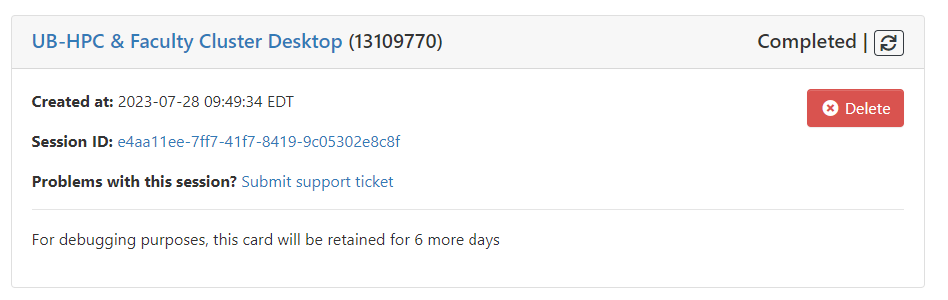

# OnDemand

Open OnDemand is a browser based single point of access for all of CCR's clusters and shared storage.  OnDemand provides a graphical interface to view, edit, download, and upload files, manage and create job templates for CCR's clusters, and access interactive applications such as remote desktops to cluster nodes, as well as GUI-based software like Jupyter Lab/Notebook, Matlab, RStudio, VMD, and VSCode.  All of this is done through the browser on almost any device, requires no additional software to be installed, and with minimal knowledge of Linux and job scheduler commands.  

_**This product is an open source project developed by [Ohio Supercomputer Center](https://openondemand.org).**_

Watch this virtual workshop to learn more about Open OnDemand at CCR:   
 

## Login to CCR's OnDemand  

!!! Warning "VPN Required"
    Access to OnDemand is restricted to UB and Roswell Park networks
    (either on campus or connected to their VPN services). [See here](../getting-access.md#vpn-access)

Login to [OnDemand](https://ondemand.ccr.buffalo.edu) with your CCR account.  Don't have one yet? [See here](../getting-access.md)  


!!! Tip "First Login - Additional Steps"
    On first login your home directory will need to be created.  Follow the
    instructions provided after login to initiate the creation of your home
    directory and SSH key pair for use on the cluster within the OnDemand
    terminal app. If, after completing the steps, the OnDemand dashboard does
    not reload, log out and back in again.  

## OnDemand Features  

This video provides a walk through demonstration of using CCR's Open OnDemand portal:
 


### Dashboard  
Once you have logged into OnDemand you will be redirected to the dashboard.  On the dashboard, CCR displays important messages in the announcement bar at the top, our message of the day (MOTD), recently used apps, and pinned apps (popular applications organized into sections).  On the right side of the dashboard you will see any currently active Interactive Sessions.  Along the top are tabs for the different features offered in OnDemand.

**Recently Used Apps**  

The `Recently Used Apps` section on the OnDemand dashboard is a new feature of OnDemand 3.0.  This will list the last 3 applications you launched in OnDemand.  When you click on one, it immediately launches a new session with the same options you last selected.  This saves you time from having to select all the options repeatedly.  This is a one-click easy button for re-launching desktops or interactive apps.

**Quick Launch App**  

The `Quick Launch` General-Compute and Debug Desktop apps provide a one click easy button for launching a desktop session on the either the debug or general-compute partition of the UB-HPC cluster.  Your job will be allocated 1 CPU, 2.8GB of RAM, and 24 hours of walltime on the general-compute partition or 1 hour for the debug partition.  You can't change any of the options for these quick launch apps.  If you require different settings, use the `UB-HPC & Faculty Cluster Desktop` app which provides many options.  


### Clusters (terminal window)  

This provides command line access to cluster login nodes.  CCR's OnDemand portal displays links for the UB-HPC and faculty clusters but these both point to the same login pool: vortex.ccr.buffalo.edu which will login you in to one of several login servers.  Here you can run Linux commands as you would if you were to SSH into a login node.  These login servers provide access to the shared storage and the Slurm scheduler to submit jobs to any of the clusters.  

!!! Note  
    The default Slurm cluster on these login nodes is ub-hpc cluster so faculty cluster users will need to specify the option "-M faculty" with all Slurm commands.

### Files App  

The Files App in OnDemand allows users to easily transfer files to or from their local computers, view and edit files on the CCR systems, and other basic file management tasks.   Here users can access files in their home directory, as well as any project or global scratch directories they may have access to.  

!!! Warning  
    Do NOT transfer large files or large amounts of files using this app.  File transfer is limited to the amount of memory on the OnDemand server, the number of users currently using it, and browser limitations.  Please use the integrated [Globus service](../hpc/data-transfer.md#globus-transfers) for large file transfers.    

Under the `Files` tab all users will see the `Home Directory` option.  On the systems this points to `/user/[CCRusername]`.  If you have access to a shared project or global scratch directory, you will see this in the Files drop down menu. You can verify what you should have access to by viewing your [active allocations in ColdFront](coldfront.md) (https://coldfront.ccr.buffalo.edu)  

You can add links to OneDrive and UB Box in the Files app as well.  You will need to use the command line to setup authentication with your UB Box and/or OneDrive account(s).  We provide information about using `rclone` to do that [here](../hpc/data-transfer.md#rclone) with an example of setting up a OneDrive link.  Once this authentication is setup, you'll see the links in the OnDemand Files app.  If you've done this setup after logging into OnDemand, you may need to restart the OnDemand web service to see the changes.  To do so, under the `Help` menu click on `Restart Web Server`  

**OneDrive**  
Follow [these instructions](../hpc/data-transfer.md#using-rclone-with-onedrive) to complete the initial connection with OneDrive using RClone.

**UB Box**  
Follow [these instructions](https://rclone.org/box/) to complete the initial connection with UB Box using RClone.  

**Globus**  
The `Globus` button in the `Files` app provides easy access to CCR's mapped collections.  Clicking the button opens a new browser window to the Globus interface and automatically opens the mapped collection associated with the directory you are currently in.  For example, if you are in your home directory in the `Files` app and click the `Globus` button, you'll be placed in the `UBuffalo - Center for Computational Research Home Directories` mapped collection and you'll see your files. If the `Globus` button is greyed out, this means there is no mapped collection associated with that directory.  For more information about using Globus, [see here](../hpc/data-transfer.md#globus-transfers).    

### Interactive Apps  

Interactive apps provide a way for users to launch and connect to an interactive batch job running on the cluster.  Users will either connect to the compute node in a Linux desktop environment or to the application they're launching.  

All the desktop and interactive apps have select menus that get pre-populated.  Depending on which cluster you choose, some of the available options, like partitions and QOS, will change.  The forms also pre-populate the Slurm account information based on the logged in user.  It's important to note that you may see some options that you don't have access to or aren't permitted to use through the OnDemand apps.  For the `UB-HPC` cluster, users should not select the option `normal` in the QOS drop down menu.  You will see the `class` and `industry` partitions; however, if you do not have the `class` or  `industry` QOS in your drop down menu, this means you don't have access to it.  Similarly, for the `Faculty` cluster, users will see all the partitions listed; however, you will only have access to a partition if the associated QOS is listed in your drop down menu.     


!!! Warning "Scavenger Partition Warning!"  
    Prior to using the `scavenger` partition, we STRONGLY recommend [reading about it](../hpc/jobs.md#scavenging-idle-cycles) to understand how it works.  When using the `scavenger` partition you are using nodes not otherwise available to you and your jobs will get cancelled when the owner of those nodes wants to use them.  

**Desktop Interactive Apps**  

Previously, CCR provided separate desktop apps for the UB-HPC and Faculty clusters.  Now there is one app for both and users are able to select which cluster to submit to.  Though users will see all partitions listed in the Faculty cluster, they will only be able to use the one(s) that match the QOS values shown in their drop down menu.  For example, to use the `ub-laser` partition in the faculty cluster, you must select the `ub-laser` QOS.  Interactive desktop sessions are limited to one node; however if you have other requirements such as number of cores (CPUs), amount of memory (RAM), or specific node features you may enter that in the form.  If you do not care what type of hardware your desktop runs on, you can leave these blank and the scheduler will allocate one CPU and 2.8GB of RAM for your session.  


!!! Info "Missing Something?"  
    If you think the drop down options for account or QOS are wrong, check [ColdFront](https://coldfront.ccr.buffalo.edu).  These values match up to allocations for resources in ColdFront.  You must be on an active allocation for the resource in order to access it.  

**Using the viz partition**  

Most software GUIs can run on any compute node at CCR through the `UB-HPC & Faculty Cluster Desktop` app.  If your software requires hardware accelerated graphics, you should request a GPU in the desktop session form.  All GPU nodes in CCR's clusters are capable of hardware accelerated graphics.  However, because the GPU nodes are often in heavy demand, we provide several nodes for those who require GPUs specifically for graphics rendering.  To access one of these GPU nodes, select the `viz` partition and QOS in the desktop session drop down menus.  Users are permitted to run one session on the viz partition at a time which is limited to 24 hours of run time.  If you require longer run time, please select the `general-compute` partition.

!!! Tip "All done?  Make sure to delete your job"  
    OnDemand desktops and apps are jobs running on the clusters.  When you're done, please make sure to close the app or desktop and then delete the running session under the `My interactive sessions` menu.  

<a name="jupyter-setup"></a>**[Jupyter Interactive Apps](#jupyter-setup)**  
The only way to run Jupyter Notebooks on the CCR clusters is using the Jupyter Notebook apps provided in OnDemand.  For those using the latest CCR software release (`ccrsoft/2023.01`) there are two Jupyter apps available.  

- The "Quick Launch Jupyter Lab/Notebook" app allows you to select which Slurm account you want to run this job under, the number of GPUs to request (if any), whether to use Jupyter Lab instead of Jupyter Notebook, and if you'd like to receive emails about your job.  You may also list additional modules to load with Jupyter.  
- The "Jupyter Lab/Notebook Advanced Options" app gives you the same options as the Quick Launch app but provides many other options for the user to specify including CPUs, RAM (memory), time for job to run (walltime), and [node features](../hpc/jobs.md#node-features).

**Loading additional software modules with Jupyter:**  
The "Extra Modules to Load with Jupyter" box on the Quick Launch and Advanced Options Jupyter/Lab Notebook apps provides a way for users to load additional software modules with Jupyter.  Enter the list of all software modules you'd like to load, including any dependencies they have, in order, and with only a space separating them.  For example, if we search for the module `pytorch` using `module spider pytorch` in the OnDemand terminal app, we will see:  
```
[login:~]$ module spider pytorch

----------------------------------------------------------------------------------------------------------------
  pytorch: pytorch/1.13.1-CUDA-11.8.0
----------------------------------------------------------------------------------------------------------------
    Description:
      Tensors and Dynamic neural networks in Python with strong GPU acceleration. PyTorch is a deep learning
      framework that puts Python first.


     Other possible modules matches:
        facenet-pytorch

    You will need to load all module(s) on any one of the lines below before the "pytorch/1.13.1-CUDA-11.8.0" module is available to load.

      gcc/11.2.0  openmpi/4.1.1

```
This means pytorch depends on both the gcc and openmpi modules. So in the "Extra Modules to Load with Jupyter" box we will enter:  `gcc/11.2.0  openmpi/4.1.1 pytorch/1.13.1-CUDA-11.8.0`  

When the Jupyter app starts, it will launch these additional modules with it and you'll have access to the pytorch software.  If you want to load several modules and they all require the same dependencies, these only need to be listed once.  For example, torchvision also requires gcc and openmpi.  If you wanted to load pytorch and torchvision, specify this in the "Extra modules to load with Jupyter" box:  `gcc/11.2.0  openmpi/4.1.1 pytorch/1.13.1-CUDA-11.8.0 torchvision/0.14.1-CUDA-11.8.0`  

!!! Tip "Properly listing multiple module dependencies"  
    You do not need to list toolchain dependencies multiple times.  If the modules you want to use all depend on the same toolchain, you can list that one time at the start of your list.  Note that the `foss` toolchain contains GCC and other packages.  The `gcccore` toolchain only contains GCC, while the `gcc` toolchain contains `gcccore` and additional packages.  You can test loading modules on the command line prior to attempting to use them with a Jupyter Notebook to ensure the order you specify works.  

<a name="vscode"></a>**[VSCode Interactive App](#vscode)** 

Visual Studio Code (VSCode) is a popular integrated development environment (IDE) that allows users to edit code in various programming languages.   Extensions available for VSCode allow users to access most popular languages and runtimes, connect to Github, and test workflows.  The application has a built-in SSH client allowing users to connect to remote servers to code directly on the server but while utilizing their personal device.  Unfortunately, almost none of those features work in the CCR HPC environment.  Though we can appreciate how handy many of these features are, they are not easy to support on an HPC system. If you're going to use VSCode in CCR's HPC environment, we HIGHLY recommend first reviewing the material in the UB Learns ["Using Python at CCR"](https://ublearns.buffalo.edu/d2l/le/discovery/view/course/288741) course.  There are two sections dedicated to the proper use of VSCode on our systems.

These are just a few of the oddities to note about how VSCode functions at CCR:

  - Loading modules when VSCode starts does not work the same way as described above for the Jupyter Lab/Notebook app.  You will need to load the software modules in a VSCode terminal after the application has started.  Despite doing this, not all software modules will work correctly in the VSCode terminal.
  - VSCode can't detect the CCR software repository and load Python and its dependencies. When choosing an interpreter, the default Python installation will be the system Python and should NOT be used. Instead, you must use a properly set up [virtual environment](../howto/python.md#virtual-environments).
  - If creating a virtual environment in VSCode, use the terminal and [these instructions](../howto/python.md#virtual-environments), NOT the Python extension and its options for creating virtual environments.  
  - Sometimes installing extensions works and sometimes it doesn't. CCR users have the permission to install extensions in their home directories but CCR support can't guarantee the installation will work, nor can we dedicate time to troubleshooting those issues.  If you're using a Python extension, make sure you pay attention to the first two items in this list  


**Job Card Formating**  

There are additions to the job cards in OnDemand 3.0 including a link to submit a help ticket that links directly to the job for easier review by the CCR IT staff.  You'll notice the verbage has changed with respect to actions you can take on a job.  A running or queued job has the `cancel` option which cancels the job and removes it from the queue.  Once a job has been completed, you can `delete` it which removes it from your list of most recent jobs.  This does NOT delete the job data in your home directory so you will need to periodically clean up data you no longer want.  The session ID link will take you directly to the subdirectory where the job's data and output files are stored.  


Once a job is completed, the job card will display an icon with circular arrows next to the "Completed" status.  To launch another job with the same specifications as the completed job requested, click on the arrow button.  



  

### Jobs Apps  

**Active Jobs**  
The Active Jobs menu option takes you to a list of your jobs (pending, running, and recently completed) on the CCR clusters.  You can filter by cluster and show all jobs or just your jobs.  This includes jobs you may be running outside of OnDemand.  Once the list is displayed, more details about individual jobs can be viewed by clicking on the arrow to the left of the job id.   Job information includes: Job ID, Job Name, User, Account, Partition, State (pending, running, completed, blocked), Total Nodes, Node List, Total CPUs, Time Limit, Time Used, and Memory Requested.  For jobs running via OnDemand, the full path of the output files for the job is displayed.  Below this there are buttons to open this location in either the file manager or the terminal, for easy access to view the job script, job log, and any error files that may have been created.  If you are reporting an error to CCR Help or asking for assistance with a job, please provide the full path of the OnDemand job files.  

**Job Metrics:**  
Below the detailed job information for any job currently running, you will see two graphs that display CPU and memory usage of the job.  This is a great tool for determining if your job is performing as expected.  For even more information about the performance of the node, click on the `Detailed Metrics` link which opens a new tab to CCR's Grafana dashboards.  Grafana displays an array of detailed hardware statistics for the node(s) your job is running on including CPU, RAM, network, Infiniband/Omnipath, Disk usage and I/O, and GPU information.  More job metrics are available in the [UBMoD metrics portal](metrics.md).  

**Job Composer**  

The Job Composer provides a template system for creating and managing batch jobs from within the OnDemand interface.  Please see the documentation provided by [Open OnDemand developers](https://osc.github.io/ood-documentation/latest/applications/job-composer.html) for more information  

### My Interactive Sessions  

This section displays your currently running sessions and those that just recently finished.  The completed jobs stay in this list for 2 days allowing you to access the link to the jobs' output files.  You can remove the links by clicking the `Delete` button.  However, this does not delete the job data directory and output files.

!!! Note "Managing your OnDemand Disk Usage"
    To clear up disk space in your home directory, you can remove directories for completed jobs when you're done retrieving the job output data.  You can find these in subdirectories under: `/user/[CCRusername]/ondemand/data/sys/dashboard/batch_connect/sys`  

### Develop (Sandbox)  

OnDemand allows users the ability to create their own interactive apps and run them in a 'sandbox' environment.  CCR does not turn this on by default, however.  Please [contact CCR Help](../help.md) to request this feature be enabled for your account.  Once it is, you'll find the `My Sandbox Apps (Development)` option under the `</>Develop` menu in OnDemand.  More information about app development is provided by the [Open OnDemand developers here](https://osc.github.io/ood-documentation/latest/app-development)  

### Help  

The Help menu offers links to CCR's support contact info, documentation, and the ability to restart your OnDemand web process.  Occasionally, you'll find your OnDemand session may be slow or unresponsive.  Users can choose the `Restart Web Server` option to restart the process that runs their individual OnDemand session.  Most of the time you will not need to do this unless directed to by CCR staff.  You may use the `Submit Support Ticket` option to easily submit a ticket to CCR help.  If you're contacting us regarding a specific job, please use the `Submit Support Ticket` button on the job card so that all the relevent job information is included in the ticket.  Then we don't have to ask you for it!    

### Troubleshooting  

[See here](../howto/ood-trouble.md)
