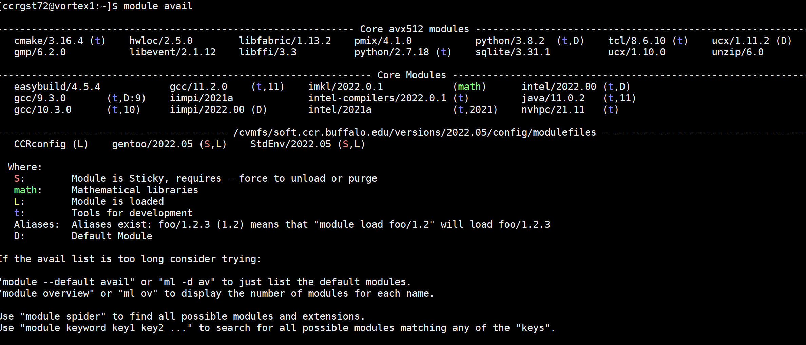

# About CCR's Software Infrastructure

CCR has redesigned how we provide software to our users.  This design is based
on years of trial & error work already done by [Compute
Canada](https://docs.alliancecan.ca/wiki/Available_software), [Conseil Européen
pour la Recherche Nucléaire (CERN)](https://home.web.cern.ch/), the [European
Environment for Scientific Software Installations
(EESSI)](https://eessi.github.io/docs/), [Ghent University](https://www.ugent.be/hpc/en), 
and the [Texas Advanced Computing Center (TACC)](https://www.tacc.utexas.edu/).
We greatly appreciate their generosity in keeping their codes open source and
their designs, documentation, and processes transparent.  We could not have
created the current environment at CCR without this incredible community!

CCR's software infrastructure utilizes [EasyBuild](https://easybuild.io/), a
software and build infrastructure framework for HPC, the [Lmod module
system](https://www.tacc.utexas.edu/research-development/tacc-projects/lmod),
the [CernVM-FS file system](https://cernvm.cern.ch/fs/), and a gentoo
combability layer to allow us and our users the flexibility of underlying
operating systems.

Here we provide info about how the software infrastructure is designed and
implemented

## Software Repository

CCR provides a repository of software using the file system called CERN Virtual
Machine File System (CVMFS).  CCR's CVMFS is mounted as
`/cvmfs/soft.ccr.buffalo.edu` on all CCR front end login servers and compute
nodes. You can even mount this on your own desktop or laptop, if you want! More
on that [here](). Compute Canada provides a great overview of CVMFS
[here](https://docs.alliancecan.ca/wiki/CVMFS) CernVM-FS website and
documentation can be found [here](https://cernvm.cern.ch/fs/)

## Compatibility Layer

The compatibility layer of the CCR software project uses [Gentoo
Prefix](https://wiki.gentoo.org/wiki/Project:Prefix) to provide a known base on
top of the host.  This is the foundation we use to build our software stack on.
Using the Gentoo Prefix allows us to install compilers and other system
packages in a non-standard location which helps avoid conflicts between
systems.  It will no longer matter what base operating system CCR runs on our
nodes or front end servers compared to your own machine as you can use our
combability layer to level the playing field.  Consider us operating system
agnostic going forward!  For those of you interested in system level testing,
we encourage you to check out all the [docs on this prefix
setup](https://wiki.gentoo.org/wiki/Project:Prefix).  However, the majority of
CCR users will probably not care one bit nor notice any difference.

## EasyBuild Software Installation

[EasyBuild](https://easybuild.io/) is a software build and installation framework that allows us to
manage (scientific) software on High Performance Computing (HPC) systems in an
efficient way.

Easyconfig files are used to specify which software to build, which version of
the software (and its dependencies), which build parameters to use (e.g., which
compiler toolchain to use), etc.  Think of them like a recipe that lists out
what is needed to create a meal.  What ingredients are required and what is
optional?  What order should the ingredients be added?  What are the steps to
preparing the meal?  Are there any special instructions we need to know for how
to properly prepare the dish?  The Easyconfig files list out all of this info
for installing a software application and then when you run the script to
install, the recipe is followed.  These "recipes" are provided by the community
of EasyBuild users and are fully unit tested and vetted.  The EasyBuild
installations allow for parallel builds, reproducibility of previous builds,
extensive logging and error reporting (nothing is THAT easy!), automated
installations, and dependency resolution, among other things.

- [What is EasyBuild?](https://docs.easybuild.io/en/latest/Introduction.html)
- [EasyBuild Documentation](https://docs.easybuild.io/en/latest/)
- [EasyConfig library](https://github.com/easybuilders/easybuild-easyconfigs)

CCR staff are working on building up our center's software repository using
these Easyconfigs.

## Toolchains

[More info on common toolchains and EasyBuild](https://docs.easybuild.io/en/latest/Common-toolchains.html#definition-and-motivation)

## ARCH-specific builds and automatic module detection

CCR has a heterogenous cluster consisting of nodes with various different CPU
architecture types.  Some codes benefit from special instruction sets specific
to CPU type.  For some of the software CCR provides, we've built the codes on
these various CPUs so that you get the best performance.

Previously, CCR users had to know which version of the module to load for the
various CPUs they ran jobs on.  This is no longer necessary.  The Lmod system
will auto-detect what type of CPU you're running on and load the module built
for that architecture.  When you view available modules, you will see the list
available for the architecture of the machine you're logged into and all the
modules built to be run anywhere.

CCR currently has the following CPU architectures in our main cluster, UB-HPC:

- avx
- avx2
- avx512
- sse3

!!! danger "sse3 no longer supported"
    we are not providing separate installations for these very old nodes

This is what it looks like when we run 'module avail' on the cluster front end
login node:



As we build up the software repository, users will see more available software
packages. These are color coded and labeled by type, where:

```
S:        Module is Sticky, requires --force to unload or purge (shown in red)

math:     Mathematical libraries (shown in green)

L:        Module is loaded (shown in yellow)

t:        Tools for development (shown in blue)

Aliases:  Aliases exist: foo/1.2.3 (1.2) means that "module load foo/1.2" will load foo/1.2.3

D:        Default Module (no need to specify the version if you wish to use the default)
```

Additional types may be added in the future to further classify software.


## Using the new modules

The new software infrastructure is available for alpha testing now.  Anyone
interested in trying it out can activate the new environment with the following
commands:

```
touch ~/.ccr_new_modules
logout
log back in again
module avail
```

!!! note
    To go back to the old modules, remove `~/.ccr_new_modules` and log out an
    back in again

More information on modules and helpful module commands


## Automatically loaded modules

This is a new concept for CCR users.  We now load several modules by default
for you when you login.  You should not unload these modules as they provide a
standard set of configurations and environment for running this software
infrastructure.  They also allow users to easily setup their own modules.  For
reference these include:

| Module      | Description |
| ----------- | ----------- |
| CCRconfig      | Sets up environment variables for global scratch, local scratch and util |
| gentoo/2022.05 | Sets up environment variables for the gentoo prefix version we're using as the base for all software installations.  This will remain in place for standardization and only be upgraded once annually.  This module also points to the Easybuild modules location.  Having multiple prefix environments available going forward will allow users the ability to use up-to-date compilers and other system libraries and not have to remain in older versions provided on the operating system.  We anticipate keeping at most two prefix versions - the current one and one previous version - which will help us purge older versions of software and keep current with new versions |
| StdEnv/2022.05 | CCR Standard Environment. This loads the CCRconfig and gentoo/2022.05 modules and, like the gentoo prefix will be modified when the prefix is updated |
